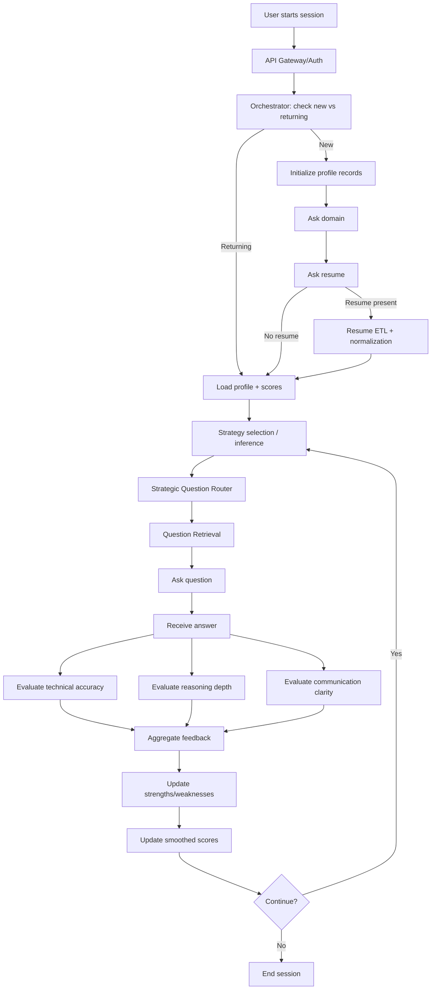
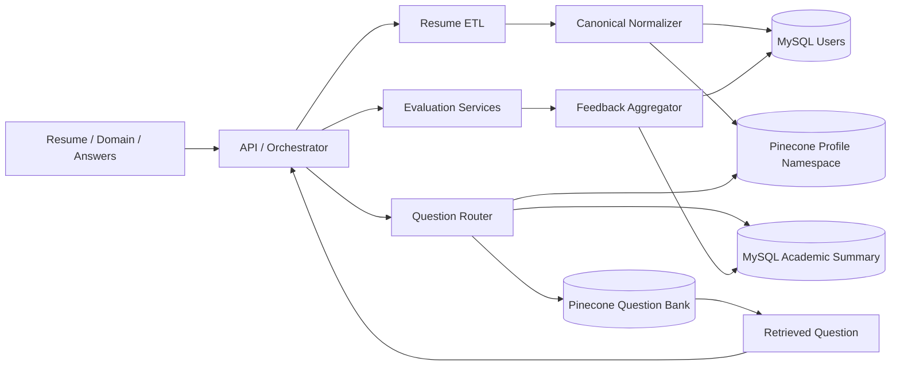
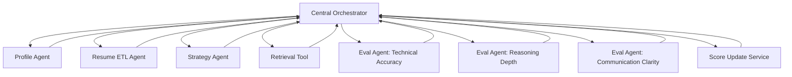
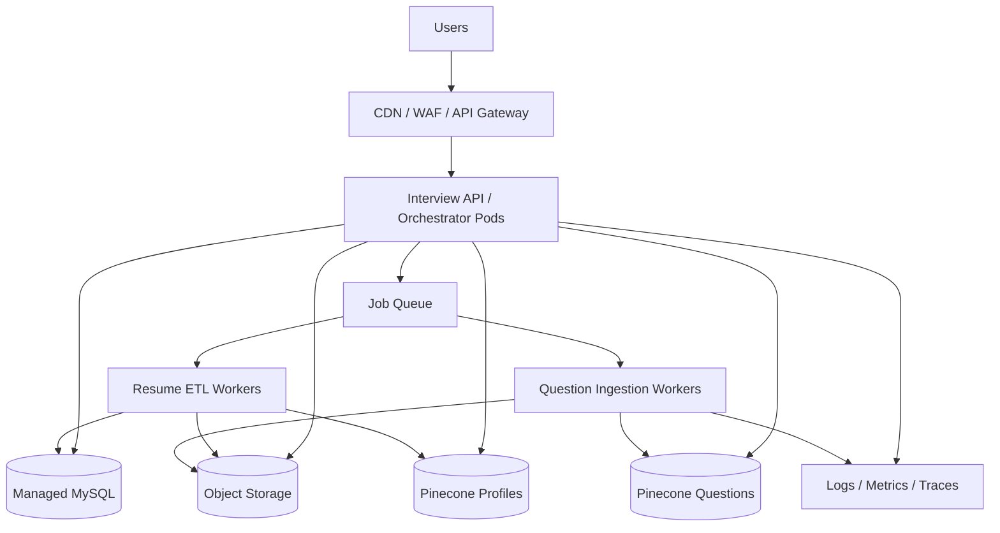
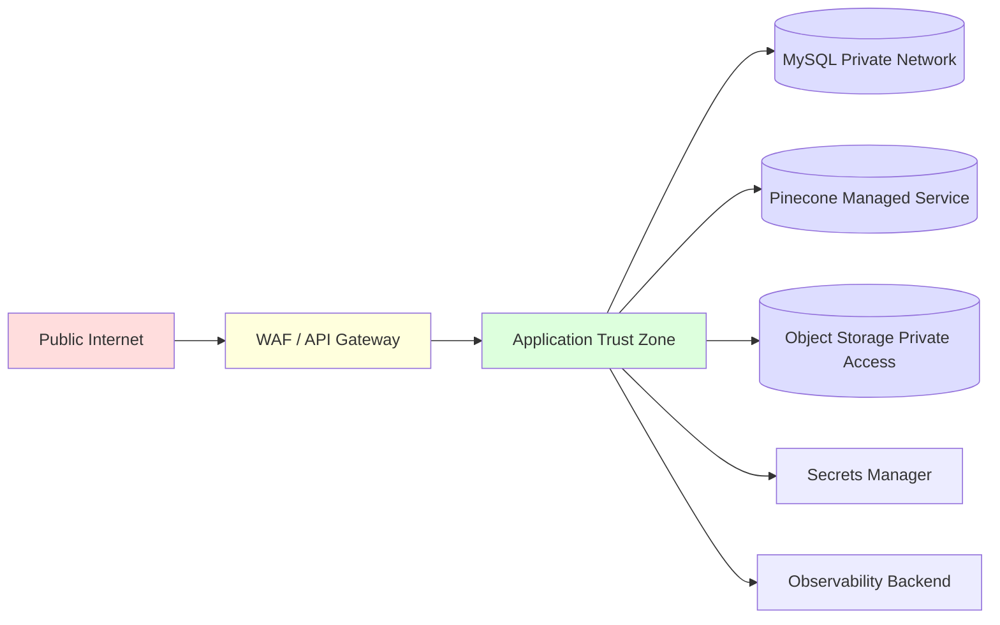

## 1. Project Overview

### 1.1 Problem statement

Interview preparation is usually static, generic, and weakly personalized. Most mock interview tools either ask random questions, behave like a monolithic chatbot, or provide shallow feedback that does not evolve with the user over time. That makes them poor at simulating real interviews, poor at tracking improvement, and poor at targeting weakness areas.

### 1.2 Business goal

Interview Mentor is designed as a production-grade adaptive interview platform that can:

* increase user interview readiness,
* improve retention by making each session personalized,
* create a reusable backend architecture for multiple interview domains,
* support scalable question-bank growth and multi-user concurrency,
* become a differentiator as an AI-native interview engine rather than just an LLM chat wrapper. 

### 1.3 User goal

The user wants a system that:

* understands their background,
* asks relevant questions,
* adjusts difficulty dynamically,
* identifies strengths and weaknesses,
* scores performance fairly,
* helps them improve over repeated sessions.

### 1.4 Why this system is needed

A generic chatbot can answer interview questions, but it does not behave like an interview platform. Interview Mentor is needed because it adds:

* profile-aware questioning,
* workflow orchestration,
* structured multi-metric evaluation,
* persistent memory,
* adaptive progression,
* strategy-based interviewing,
* reusable agent boundaries.  

### 1.5 Key differentiators

The strongest differentiator is architectural: the main orchestrator is **orchestration-aware, not implementation-aware**. It only knows when to invoke a specialized sub-agent, what input to pass, and what output contract to consume. It does not need to know internal retrieval logic, ETL logic, or scoring internals. That gives modularity, abstraction, maintainability, and future extensibility. 

Other differentiators:

* resume-to-profile ETL with canonical normalization,
* strategic query planning before retrieval,
* question-bank ingestion with taxonomy standardization,
* evaluation across three explicit dimensions,
* smoothed score updates using EMA + lifetime mean hybrid,
* dual persistence model: relational truth + vector memory.     

---

## 2. Scope

### 2.1 In scope

* Candidate onboarding
* New vs returning user detection
* Domain capture
* Resume ingestion and ETL
* Canonical normalization of domain and skills
* Persistent user profile
* Strategy-driven question planning
* Question retrieval from vectorized interview bank
* Interactive interview loop
* Answer evaluation on technical accuracy, reasoning depth, and communication clarity
* Feedback aggregation
* Score persistence and smoothing
* Strength/weakness updates
* Repeated session continuity.    

### 2.2 Out of scope

* Live voice bot as a hard requirement
* Full recruiter-side ATS workflows
* Human interviewer scheduling
* Candidate proctoring / anti-cheating webcam monitoring
* Enterprise multi-org admin console
* Fine-tuning proprietary LLMs
* Video analysis
* Real-time collaborative interview panels

### 2.3 Assumptions

* Frontend exists as web/mobile UI and calls backend APIs.
* Authentication is handled with OAuth2/JWT, though the current code artifacts mainly show backend workflow and storage layers.
* Resume files are stored in secure object storage in production, even though local/file URL paths are supported in current ETL code.
* Background processing is introduced for expensive ETL and ingestion jobs.
* Multi-tenant isolation is required in production even if the current prototype is user-centric.
* LLM orchestration remains centralized, while specialized sub-agents remain modular units behind contracts.

### 2.4 Constraints

* LLM latency and cost
* External provider availability
* Resume parsing quality variability
* Retrieval quality dependence on taxonomy and vector coverage
* Need for deterministic workflow around inherently probabilistic model outputs
* Need to keep prompt context short and bounded

---

## 3. Functional Requirements

### 3.1 Core features

The system must:

* identify new vs returning users,
* collect domain and resume input,
* extract structured profile attributes from resume,
* normalize skills/domain into canonical forms,
* store profile in persistent stores,
* choose interview strategy,
* generate a query plan,
* retrieve the next best question,
* ask the user,
* evaluate the answer on three metrics,
* generate combined feedback,
* update scores and profile,
* decide whether to continue or end.   

### 3.2 Main workflows

**New user workflow**

1. Check if user exists.
2. Initialize base relational and vector profile.
3. Ask for domain.
4. Ask for resume.
5. Run resume ETL if resume is present.
6. Merge resume-derived profile into persistent stores.
7. Start adaptive interview loop. 

**Returning user workflow**

1. Load stored profile and academic summary.
2. Select strategy or infer it.
3. Query and retrieve next question.
4. Evaluate answer.
5. Update profile and scores.
6. Continue until user exits.  

### 3.3 User journeys

**Candidate**

* uploads resume or skips,
* receives tailored question,
* answers,
* gets actionable feedback,
* repeats over multiple sessions,
* sees progressive improvement.

**Admin/content curator**

* ingests or updates question bank PDFs,
* verifies taxonomy quality,
* monitors retrieval quality and coverage.

**Platform operator**

* monitors latency, failures, provider usage, and storage health.

### 3.4 System actors

* Candidate
* Frontend client
* API gateway/backend
* Orchestration engine
* Profile ETL agent
* Strategy planning agent
* Retrieval service
* Evaluation service
* Persistence layer
* Admin ingestion pipeline
* Monitoring and security services

---

## 4. Non-Functional Requirements

### 4.1 Scalability

The platform must scale horizontally for concurrent interview sessions. Stateless API/orchestrator instances should scale independently from ETL workers and ingestion workers.

### 4.2 Performance

Target interactive question round-trip should remain low enough to feel conversational. Retrieval should stay fast; evaluation can tolerate slightly higher latency than retrieval. Resume ETL can be asynchronous if needed.

### 4.3 Availability

The system should remain available even if one provider degrades. Question retrieval and session continuity should have graceful fallback.

### 4.4 Reliability

Profile updates must be durable. Repeated retries should be idempotent. Partial failures must not corrupt profile state.

### 4.5 Security

User documents, profiles, and scores are sensitive. Encryption, access control, audit logging, and prompt-injection controls are mandatory.

### 4.6 Privacy

Resume data and interview content should have clear retention rules and tenant isolation.

### 4.7 Maintainability

Sub-agents must be replaceable behind stable I/O contracts. This is one of the system’s core architectural principles. 

### 4.8 Observability

Need logs, traces, model latency metrics, retrieval quality metrics, and business KPIs.

### 4.9 Cost efficiency

Use smaller/faster models where possible for routing and scoring, reserve expensive paths for tasks that actually need them. Current code already uses fast embedding models and Gemini Flash-style models, which aligns with that direction.  

### 4.10 Extensibility

New interview domains, new evaluation dimensions, new sub-agents, and new storage or provider backends should be pluggable.

---

## 5. System Architecture Overview

### 5.1 Architecture style

This system is best described as a **modular, agent-orchestrated backend with centralized workflow control and polyglot persistence**.

It is not a single monolithic chatbot and not a fully decentralized swarm. Instead, it uses a central orchestrator to manage state transitions, while specialized sub-agents handle profile ETL, question planning, retrieval, and evaluation.  

### 5.2 Why this architecture was chosen

A centralized orchestrator is the right choice here because interview flow is stateful and sequential:

* onboarding,
* profile enrichment,
* question planning,
* questioning,
* evaluation,
* profile mutation,
* loop control.

That sequence benefits from explicit workflow control. At the same time, specialized work units should remain isolated, so the orchestrator does not absorb prompt complexity, retrieval complexity, or scoring complexity. 

### 5.3 Major subsystems

* Client / interview UI
* API gateway / session API
* Orchestration engine
* Profile agent
* Resume ETL service
* Strategic question router
* Question retrieval service
* Evaluation service
* Feedback aggregator
* Score update service
* MySQL profile store
* Pinecone profile memory
* Pinecone question-bank vector store
* Question ingestion pipeline
* Monitoring and security layer

### 5.4 Centralized vs distributed components

**Centralized**

* session state machine,
* loop progression,
* continue/exit decisions,
* top-level orchestration contract.

**Distributed / specialized**

* resume ETL,
* taxonomy normalization,
* query planning,
* vector search,
* metric evaluation,
* score smoothing,
* question-bank ingestion.

### 5.5 Agent-based design

The main orchestrator only consumes outputs from sub-agents. That is the right abstraction line:

* Profile agent returns normalized profile updates.
* Strategy agent returns a compact query plan.
* Retrieval returns a question and metadata.
* Evaluation returns structured metric results.
* Score service returns updated scores. 

---

## 6. Architecture Components

### 6.1 API Gateway / Session Layer

**Responsibility:** Accept authenticated client requests, create session context, enforce rate limits, hand off to orchestrator.
**Inputs:** user identity, domain, resume URL/file, user answers, strategy choice.
**Outputs:** prompts, next question, feedback, session state.
**Dependencies:** auth provider, orchestrator, rate limiter.
**Why it exists:** isolates client concerns from orchestration internals.
**Alternative:** direct frontend-to-orchestrator coupling. Rejected because it weakens security and makes versioning harder.

### 6.2 Orchestration Engine

**Responsibility:** Own the interview state machine.
**Inputs:** session state, user messages, profile state, sub-agent outputs.
**Outputs:** workflow transitions and final user-facing artifacts.
**Dependencies:** profile service, ETL, router, retrieval, evaluators, persistence.
**Why it exists:** interview flow is stateful and must be deterministic.
**Alternative:** one large agent prompt. Rejected because state management, testing, and failure recovery become weak.
The current LangGraph flow explicitly models new-user checks, domain capture, resume ETL, question querying, answer collection, three evaluation branches, aggregation, profile updates, and continue/exit routing. 

### 6.3 Resume ETL Service

**Responsibility:** Extract resume text, structure it, normalize domain/skills, and load profile data.
**Inputs:** resume URL/path, optional name hint, user_id.
**Outputs:** normalized interview profile.
**Dependencies:** PDF loaders, LLM, canonical normalizer, MySQL, Pinecone.
**Why it exists:** resume parsing is expensive, specialized, and independent from the main loop.
**Alternative:** parse resume inline in the main prompt. Rejected because it bloats context and reduces repeatability.
Current design extracts PDF pages, invokes a structured LLM, canonicalizes domain and skills via vector-based normalization, and persists the normalized result to both MySQL and Pinecone.  

### 6.4 Strategic Question Router

**Responsibility:** Convert current profile + strategy into a compact retrieval plan.
**Inputs:** domain, skills, strengths, weaknesses, scores, summary, requested strategy.
**Outputs:** `QueryPlan(strategy, query, domain, skill, difficulty, lang)`.
**Dependencies:** MySQL, Pinecone profile metadata, LLM.
**Why it exists:** question retrieval should be planned, not random.
**Alternative:** retrieve directly using the raw profile text. Rejected because it reduces control over strategy and difficulty.
The current router supports `skills`, `scores`, `weakness`, and `strength` strategies and uses semantic-first retrieval to avoid overfitting to strict labels. 

### 6.5 Retrieval Service

**Responsibility:** Fetch the next best interview question from the question bank.
**Inputs:** query plan, filters, namespace.
**Outputs:** question text, metadata, question id.
**Dependencies:** Pinecone question index.
**Why it exists:** retrieval is a distinct concern from strategy planning.
**Alternative:** hardcoded question flows. Rejected because the platform needs breadth and adaptability.

### 6.6 Evaluation Service

**Responsibility:** Score an answer across three metrics.
**Inputs:** question, answer, metric rubric.
**Outputs:** per-metric feedback and score.
**Dependencies:** LLM with structured output.
**Why it exists:** separate evaluation paths give cleaner rubrics and clearer observability.
**Alternative:** one overall evaluator only. Rejected because it hides why a candidate did well or badly.
Current evaluators explicitly score technical accuracy, reasoning depth, and communication clarity. 

### 6.7 Feedback Aggregator

**Responsibility:** combine metric outputs into a short overall feedback summary and score.
**Inputs:** three metric outputs.
**Outputs:** combined score, overall narrative feedback.
**Dependencies:** evaluation outputs, optional summarization LLM.
**Why it exists:** it turns raw rubric scores into a user-friendly feedback artifact.

### 6.8 Score Update Service

**Responsibility:** smooth per-question noise and persist longitudinal performance.
**Inputs:** new metric scores + previous score state.
**Outputs:** updated per-metric scores, overall score, incremented attempt count.
**Dependencies:** MySQL academic summary.
**Why it exists:** one answer should not swing the profile too violently.
**Alternative:** naive overwrite or simple arithmetic mean. Rejected because it is either unstable or slow to adapt.
Current implementation uses metric-level EMA and a hybrid overall score combining metric EMA and lifetime mean.  

### 6.9 Relational Profile Store (MySQL)

**Responsibility:** system of record for user profile and academic summary.
**Inputs:** user metadata, skills, strengths, weaknesses, categories, academic metrics.
**Outputs:** normalized profile rows and academic history state.
**Why it exists:** transactional durability and consistent writes.
Current schema includes `users` and `academic_summary`, with JSON-string list fields and explicit scoring columns including `question_attempted`.  

### 6.10 Vector Profile Store (Pinecone)

**Responsibility:** semantic profile snapshot used by planners and retrieval-related components.
**Inputs:** profile summary, canonical domain, skills, strengths, weaknesses.
**Outputs:** vectorized profile metadata fetches.
**Why it exists:** semantic access to profile state without rebuilding long textual context every time.
Current implementation stores one profile vector per user in a dedicated namespace. 

### 6.11 Question Bank Ingestion Pipeline

**Responsibility:** convert source PDFs into atomic, normalized, vectorized interview questions.
**Inputs:** PDF question banks, taxonomies, version.
**Outputs:** Pinecone vectors with skill/domain/difficulty/tags/categories metadata.
**Why it exists:** question quality and metadata quality are foundational to adaptive retrieval.
Current ingestion flow extracts text from PDFs, segments into atomic questions with an LLM, standardizes taxonomy labels, embeds them, and upserts them into Pinecone. 

---

## 7. End-to-End Workflow

This mirrors your actual LangGraph-style flow: user gating, onboarding, resume ETL, question query, answer capture, three parallel evaluation branches, aggregation, profile updates, and continue/exit control. 

### Failure points and fallback paths

* **Resume load fails:** continue with domain-only interview and mark profile as partial.
* **Normalization fails:** persist raw labels and flag quality issue for later cleanup.
* **Question retrieval miss:** ask curated fallback general question.
* **One metric evaluator fails:** retry once, then degrade to partial evaluation and mark session incomplete.
* **MySQL write fails:** retry and push to durable write queue.
* **Pinecone unavailable:** use fallback metadata-based or curated question set.
* **LLM provider timeout:** circuit-breaker and fallback model route.

---

## 8. Data Flow Architecture

### How data enters

* user-entered domain,
* resume URL/file,
* user answers,
* admin-ingested question-bank PDFs.

### How data is processed

* resume text extraction,
* structured profile generation,
* canonical normalization,
* query planning,
* semantic retrieval,
* multi-metric evaluation,
* score smoothing.

### How data is stored

* MySQL stores durable transactional profile and academic summary.
* Pinecone stores semantic profile snapshots and question vectors.
* Object storage stores resume artifacts in production.
* Monitoring stack stores logs/traces/metrics.

### How data is retrieved

* MySQL for authoritative profile/scores,
* Pinecone profile namespace for semantic profile snapshot,
* Pinecone question namespace for next-question retrieval.   

---

## 9. AI / ML / LLM / Agent Architecture

### 9.1 Main orchestration logic

The orchestrator owns control flow and state transitions. It does not perform all domain logic itself. It calls sub-agents/services and consumes typed outputs.

### 9.2 Role of central agent

The central agent decides:

* what happens next,
* when a sub-agent is invoked,
* which result is needed,
* whether the session continues or terminates.

It should not know retrieval internals, ETL internals, or scoring internals. That is the core design strength in your architecture. 

### 9.3 Role of sub-agents

* **Profile agent**: maintains long-term user state.
* **Resume ETL agent**: extracts and normalizes resume data.
* **Strategy agent**: decides next-question intent.
* **Retrieval tool/service**: fetches best-fit question.
* **Evaluation agent(s)**: score answer across three metrics.
* **Score updater**: stabilizes longitudinal performance state.

### 9.4 Tool-calling architecture

This design is effectively tool/sub-agent orchestration:

* input contracts are small,
* outputs are structured,
* prompts are narrow,
* failures are isolated,
* replacement is easy.

### 9.5 Memory / profile / context handling

Two memory layers exist:

* **durable relational memory** for exact profile state and scores,
* **semantic vector memory** for compact profile retrieval and planner context.  

### 9.6 Prompt orchestration strategy

Prompting should be separated by concern:

* resume extraction prompt,
* strategic planning prompt,
* metric evaluation prompt,
* aggregation prompt.

That is better than a single giant system prompt because it reduces context pollution and improves testability. Current code already follows this pattern with structured outputs.   

### 9.7 Evaluation / scoring / guardrails

Guardrails should include:

* schema-bound outputs,
* rubric-specific prompts,
* conservative grading rules,
* profanity/abuse filters,
* prompt injection detection on resume/question-bank text,
* per-agent timeouts,
* fallback providers.

### 9.8 Why sub-agents instead of one monolithic agent

Because one monolithic agent would:

* need too much context,
* be harder to test,
* be less deterministic,
* blur responsibilities,
* create brittle prompts,
* be harder to replace or scale independently.

Your current design intentionally avoids that by keeping the main layer focused on orchestration and consuming only sub-agent outputs. 

### 9.9 Agent orchestration diagram

---

## 10. Integration Architecture

### 10.1 External APIs / services

* Gemini-family LLM for orchestration-adjacent structured tasks and evaluations
* OpenAI embeddings for vectorization
* Pinecone for vector storage and retrieval
* MySQL for transactional persistence
* PDF parsing libraries for resume/question-bank extraction
* OAuth2 identity provider in production
* Object storage for resume files
* Queue system for async ETL/ingestion
* Monitoring stack

The current code artifacts explicitly show Gemini model usage, OpenAI embedding usage, Pinecone, and MySQL.    

### 10.2 API gateway-level architecture

* TLS termination
* auth verification
* rate limiting
* request ID injection
* payload validation
* routing to interview service
* admin route segregation
* audit log emission

---

## 11. Deployment Architecture

### 11.1 Development

* local containers,
* local MySQL,
* Pinecone dev namespace,
* local environment variables,
* mocked auth.

### 11.2 Staging

* same topology as prod at smaller scale,
* synthetic question bank,
* masked test resumes,
* canary deploys,
* chaos and fallback testing.

### 11.3 Production

Recommended:

* API Gateway / Load Balancer
* stateless interview API pods
* separate worker pool for ETL
* separate worker pool for ingestion
* MySQL managed instance
* Pinecone managed index
* object storage bucket
* secrets manager
* tracing/logging/metrics stack
* WAF + rate limiter

### 11.4 CI/CD

* lint
* unit tests
* prompt contract tests
* retrieval regression tests
* container build
* vulnerability scan
* deploy to staging
* smoke test
* canary to production
* rollback on SLA breach

### 11.5 Load balancing and autoscaling

* API layer autoscaled on CPU + request concurrency
* ETL workers autoscaled on queue depth
* ingestion workers scheduled off-peak
* model rate limits monitored centrally

---

## 12. Security Architecture

### 12.1 Authentication

Assume OAuth2/OIDC with JWT bearer tokens.

### 12.2 Authorization

RBAC with at least:

* candidate,
* admin/content curator,
* operator.

### 12.3 Encryption

* TLS in transit
* KMS-backed encryption at rest
* encrypted object storage
* secret values stored in secret manager, not env files in production

### 12.4 Input validation

* file type and size validation for resumes,
* URL allow/block lists,
* PDF sanitization,
* schema validation for LLM outputs,
* metadata validation during ingestion.

### 12.5 Prompt injection protection

* treat resumes and question-bank docs as untrusted input,
* strip prompt-like instructions from documents,
* isolate tool permissions,
* do not allow raw document text to override system role,
* add detector rules for instruction-in-document patterns.

### 12.6 Data isolation

All reads and writes scoped by tenant/user identity. Pinecone namespaces and metadata filters should prevent cross-user leakage.

### 12.7 Abuse prevention

* per-user and per-IP rate limits,
* quota on expensive ETL jobs,
* bot detection,
* anomaly detection on request volume.

### 12.8 Audit logging

Audit:

* login,
* resume upload,
* profile change,
* score update,
* admin ingestion,
* model/provider fallback events.

### 12.9 Security boundaries

---

## 13. Database and Storage Architecture

### Storage decision mapping

| Data type                                                | Store               | Why                                         |
| -------------------------------------------------------- | ------------------- | ------------------------------------------- |
| user identity, domain, strengths, weaknesses, categories | MySQL               | durable transactional source of truth       |
| academic summary, attempts, smoothed scores              | MySQL               | exact updates and relational integrity      |
| semantic profile snapshot                                | Pinecone            | fast semantic access to compact user memory |
| question bank vectors                                    | Pinecone            | low-latency semantic retrieval              |
| resume files/raw PDFs                                    | object storage      | cheap encrypted blob storage                |
| logs/metrics/traces                                      | observability stack | monitoring and troubleshooting              |

Current artifacts explicitly support MySQL `users` and `academic_summary`, Pinecone profile snapshots, and Pinecone question vectors.    

### Data retention

Recommended:

* resume raw file: 7–30 days unless user opts into storage,
* normalized profile: retained while account is active,
* academic history: 12–24 months,
* audit logs: 1 year,
* deleted-user purge workflow with hard delete and tombstone tracking.

### Backup and recovery

* MySQL daily full + PITR
* object storage versioning
* question-bank source artifacts versioned
* Pinecone rehydration from source ingestion pipeline
* disaster recovery runbook for provider outage

---

## 14. Scalability and Performance Design

### How the system scales

* stateless API nodes scale horizontally
* orchestration workers scale by active sessions
* ETL workers scale separately
* ingestion workers run batch-oriented and separate from user traffic

### Bottlenecks

* LLM latency
* vector DB latency under high concurrency
* PDF parsing
* write amplification if every answer persists synchronously
* provider rate limits

### Caching strategy

* cache profile metadata in short-lived Redis/session cache
* cache query-plan results for same session step if replayed
* cache canonical normalization hits
* cache popular question metadata
* optionally prompt-cache repeated rubric prompts

### Rate limiting

* per session
* per user
* per upload
* per admin ingestion batch

### Queues

Use queue for:

* resume ETL,
* question ingestion,
* deferred analytics,
* retryable write reconciliation.

### Model latency considerations

Use fast/cheap models for:

* query planning,
* structured extraction,
* short rubric evaluations.

Reserve heavier models only for advanced explanations or optional deep feedback.

### Cost/performance tradeoffs

Your current choices already point in the right direction:

* `text-embedding-3-small` for embeddings,
* compact structured prompts,
* semantic-first retrieval,
* batched normalization queries,
* parallel metric evaluations.   

---

## 15. Reliability and Fault Tolerance

### Retry strategies

* exponential backoff for provider calls
* idempotent DB writes
* deduplicated ingestion by content hash
* retriable ETL jobs with max attempts

Question ingestion already uses content hashing and dedupe logic, which is a strong base for idempotency. 

### Fallback mechanisms

* fallback question if retrieval miss
* fallback parser if primary PDF loader fails
* fallback model/provider
* partial evaluation mode if one evaluator times out

The resume ETL already demonstrates loader fallback behavior. 

### Circuit breakers

Introduce provider-specific circuit breakers for:

* LLM calls
* Pinecone calls
* object storage
* MySQL

### Graceful degradation

If personalization fails, the interview should still continue in generic mode rather than fully failing.

### Failure isolation

Each sub-agent should fail within its own boundary. The orchestrator records the failure and applies fallback without exposing internal errors to the user.

### Recovery handling

* resume ETL jobs resumable
* session state checkpointing
* replay-safe score update workflow
* dead-letter queues for poison jobs

---

## 16. Observability and Monitoring

### Logs

* structured JSON logs
* request/session/user correlation IDs
* sub-agent invocation logs
* provider call logs
* error category tags

### Metrics

Technical:

* question retrieval latency
* evaluation latency per metric
* ETL success rate
* Pinecone query latency
* MySQL query latency
* error rate by component
* fallback rate
* provider timeout rate

Business:

* session completion rate
* average questions per session
* resume upload completion rate
* retention by day/week
* score improvement over time
* weak-skill coverage
* strategy selection distribution

### Traces

Distributed traces across:

* gateway
* orchestrator
* ETL
* vector retrieval
* scoring
* persistence writes

### Alerting

Alert on:

* API latency SLA breach
* provider failure spikes
* score write failures
* ingestion failure spikes
* abnormal cost increase
* vector recall degradation

---

## 17. Architecture Decision Rationale

### Why this architecture is good for this project

Because the product is fundamentally:

* stateful,
* adaptive,
* personalization-heavy,
* retrieval-backed,
* multi-step,
* explainability-sensitive.

A centralized orchestrator with specialized sub-agents matches that shape well.

### Major tradeoffs

* more components than a single chatbot
* more contracts to manage
* higher coordination complexity
* extra operational surface area

But those costs are justified because personalization, testing, and extensibility improve significantly.

### Alternative architectures considered

**A. Single monolithic LLM agent**
Rejected because it would be prompt-heavy, hard to debug, weak on deterministic flow, and too coupled.

**B. Pure rules engine + no agentic planning**
Rejected because it would be rigid and not adapt well to diverse resumes and evolving profile state.

**C. Fully distributed microservices from day one**
Rejected because it would add operational complexity too early. A modular backend with clear internal boundaries is the better maturity path.

---

## 18. Risks and Mitigations

### Technical risks

* external LLM dependency
* vector retrieval mismatch
* schema drift between stores
* ETL parse failures

Mitigation:

* provider abstraction
* fallback questioning
* contract tests
* idempotent profile sync
* replayable jobs

### Product risks

* feedback feels generic
* difficulty adaptation feels unfair
* low-quality question bank hurts trust

Mitigation:

* rubric tuning
* human QA on question bank
* retrieval evaluation set
* session analytics review

### Data risks

* bad resume extraction
* stale profiles
* inconsistent canonical labels

Mitigation:

* normalization pipeline
* profile refresh option
* versioned taxonomy

### AI-specific risks

* hallucinated evaluation
* overconfident scoring
* prompt injection from resume/question docs

Mitigation:

* structured schema outputs
* rubric isolation
* conservative grading prompts
* injection sanitization
* sampling audits

### Scaling risks

* ETL spikes
* ingestion contention
* model rate limits

Mitigation:

* separate worker pools
* queues
* concurrency controls
* backpressure

### Security risks

* document leakage
* cross-user data exposure
* admin ingestion abuse

Mitigation:

* tenant scoping
* encrypted storage
* WAF/rate limits
* RBAC
* audit logs

---

## 19. Future Enhancements

* voice interview mode with STT/TTS
* recruiter dashboard and candidate analytics
* domain-specific evaluation rubrics
* difficulty calibration using historical cohort benchmarking
* session replay timeline
* fine-grained feedback history
* recommendation engine for study material after each weakness detection
* multi-language interview mode
* model router by task and cost budget
* reinforcement loop from user-rated feedback usefulness

---

## 20. Summary

Interview Mentor is production-worthy because it is not designed as a thin LLM wrapper. It is a stateful, adaptive interview platform built around a central orchestrator, bounded specialized sub-agents, structured evaluation, semantic retrieval, and durable memory. The architecture is strong because it separates orchestration from implementation: the main controller knows **what** outcome is needed, while specialized sub-agents own **how** they produce that outcome. Combined with polyglot persistence, score smoothing, taxonomy-aware retrieval, and explicit fault handling, this makes the system suitable for real-world scaling and interview presentation.     

# Concise architecture summary for interviews

Interview Mentor is a centralized agent-orchestrated mock interview platform. A main orchestrator controls the interview flow, while specialized sub-agents handle resume ETL, profile management, question planning, retrieval, and evaluation. User profile state is stored durably in MySQL and semantically in Pinecone. The next question is not random; it is planned from user strengths, weaknesses, skills, and scores, then retrieved from a vectorized question bank. Answers are evaluated across technical accuracy, reasoning depth, and communication clarity, and scores are updated using EMA-style smoothing so the platform adapts over time instead of reacting to one isolated answer.

# How to explain this HLD in an interview

Start with this flow:

1. “This is not a single chatbot; it is a centralized orchestration architecture.”
2. “The orchestrator owns session flow, but specialized sub-agents own profile ETL, strategy, retrieval, and evaluation.”
3. “I use MySQL as the source of truth and Pinecone for semantic memory and question retrieval.”
4. “The interview adapts based on long-term profile plus the latest answer.”
5. “Evaluation is split into three metrics, then aggregated and persisted with score smoothing.”
6. “The key design principle is that the main agent is orchestration-aware, not implementation-aware.”

That explanation is strong because it shows architecture maturity, not just model usage.

# Likely architecture questions and good answers

### 1. Why not use a single LLM agent?

Because interview flow is stateful and repeatable, while resume parsing, planning, retrieval, and evaluation are different concerns. A single agent would be harder to control, test, and scale.

### 2. Why do you need both MySQL and Pinecone?

MySQL is for exact, durable state and transactional updates. Pinecone is for semantic profile access and question retrieval. They solve different problems.

### 3. Why keep a central orchestrator?

Because the interview is a workflow, not just a prompt. The orchestrator makes state transitions explicit and deterministic.

### 4. Why use sub-agents?

To isolate responsibilities, reduce prompt complexity, and make each unit independently testable and replaceable.

### 5. How do you prevent one bad answer from ruining the profile?

I use smoothed score updates rather than raw overwrite. Per-metric EMA and hybrid overall scoring stabilize the profile over time. 

### 6. How does the system choose the next question?

It first builds a query plan from the profile and strategy, then retrieves from the question bank using semantic-first logic with optional filters.

### 7. How do you handle retrieval mismatch?

Fallback question path, metadata filters, taxonomy standardization, and offline retrieval evaluation.

### 8. What happens if resume parsing fails?

The session continues in partial-profile mode using domain input and generic adaptive questioning.

### 9. How would you scale this in production?

Stateless API scaling, separate worker pools for ETL and ingestion, queues, caching, and managed storage/services.

### 10. What is the biggest architectural strength here?

The orchestrator only depends on output contracts from specialized sub-agents, which keeps the architecture modular and extensible.
