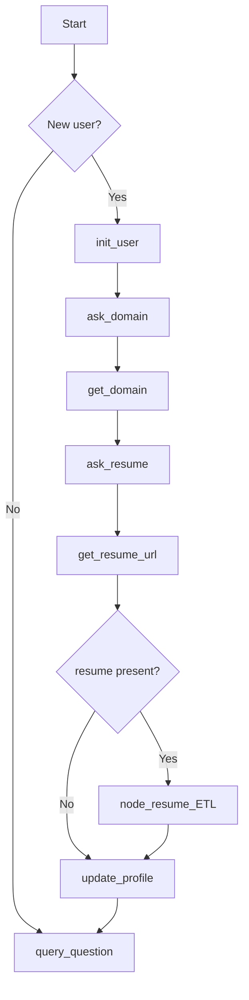
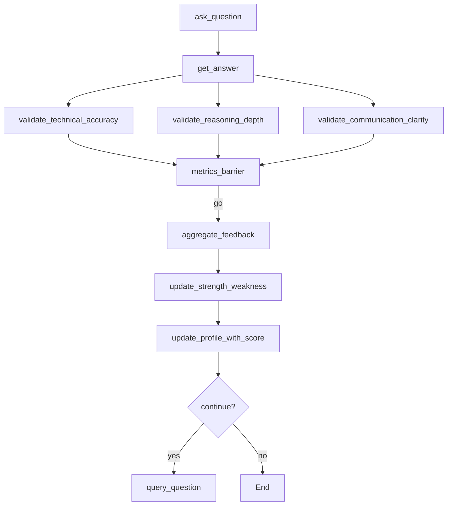
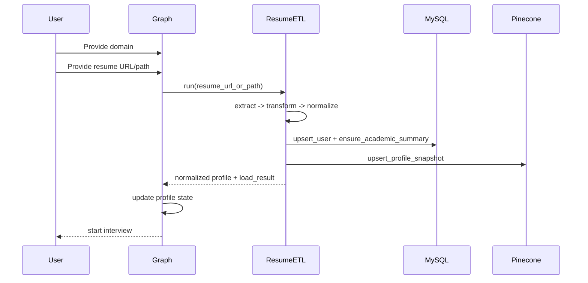
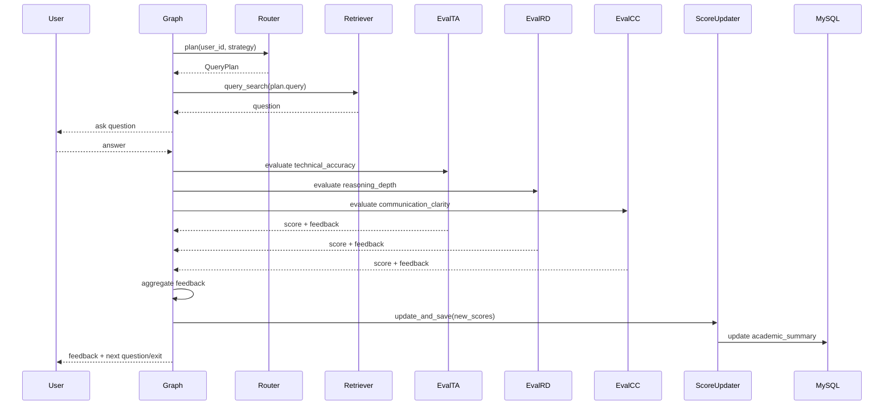
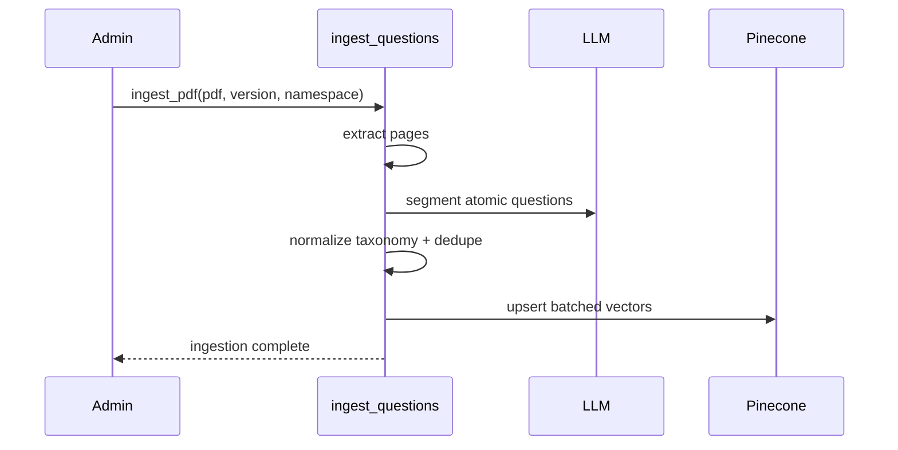

## Project: Interview Mentor

## 1. Document Purpose and Scope

This document describes the final low-level design for **Interview Mentor**, an adaptive AI interview platform that uses resume-derived profile context, retrieval-based question selection, multi-metric answer evaluation, and longitudinal score updates.

This LLD is meant to serve four purposes:

1. engineering documentation for implementation and maintenance,
2. interview discussion material for architecture walkthroughs,
3. developer handoff guidance for future contributors,
4. a clean separation between what is **currently implemented in the repo** and what is **recommended for future production hardening**.

**Current implemented scope.** The repository currently contains the core workflow engine, profile persistence, resume ETL, planning logic, question ingestion utilities, vector profile storage, and score update logic. The interactive flow is driven through a LangGraph state machine with in-memory checkpointing and interrupt/resume mechanics, rather than a production HTTP API layer.

**Out-of-scope for current implementation.** The repo evidence does not show a production REST gateway, persistent session/turn/event tables, queue-backed async workers, or a full observability stack. Those are documented here as future-state recommendations, not as currently implemented facts.

---

## 2. Technical Overview

Interview Mentor is implemented as a **centralized orchestration workflow** with specialized modules for:

* profile storage,
* resume extraction and normalization,
* strategic query planning,
* question ingestion and semantic retrieval,
* answer evaluation across multiple dimensions,
* longitudinal score updates.

The architectural principle is strong: the main orchestration layer is responsible for **flow control**, while specialized components are responsible for **task execution**. That lines up with your intended explanation that the main agent is orchestration-aware rather than implementation-aware. The repo implements this pattern in practice through a LangGraph `StateGraph` that coordinates `ResumeETL`, `StrategicQuestionRouter`, `QuestionSearch`, `ScoreUpdater`, `RelationalDB`, and `VectorStore`.

### Current implemented design

The current runtime model is a **single-process Python application** with a graph-based state machine. It uses:

* **LangGraph** for orchestration and interrupts,
* **Gemini 2.5 Flash** for structured planning and evaluation,
* **MySQL** for relational profile and academic summary state,
* **Pinecone** for profile vectors and question-bank vectors,
* **OpenAI `text-embedding-3-small`** for embeddings,
* **PyPDFLoader / PyMuPDFLoader fallback** for resume extraction.

### Recommended future-state

For production, the same modular design should be preserved, but wrapped in a service boundary:

* API service,
* background ETL/ingestion workers,
* persistent session store,
* request-scoped logging/tracing,
* Redis-backed cache and idempotency,
* queue-based async jobs.

---

## 3. System Modules and Responsibilities

### 3.1 Orchestrator / Workflow Graph

The orchestration graph is the heart of the system. Its current state flow is:

* determine new vs existing user,
* initialize user if new,
* collect domain,
* collect resume URL/path,
* optionally run resume ETL,
* update profile,
* generate next query plan,
* retrieve question,
* collect answer,
* run three evaluators in parallel,
* aggregate feedback,
* update strengths/weaknesses,
* update smoothed scores,
* decide continue vs exit.

This is implemented with `StateGraph(State)` and compiled using `InMemorySaver`, which means checkpointing exists today but is not yet durable across process restarts. 

### 3.2 Relational Profile Store

`RelationalDB` is the current system of record for long-lived structured user state. It stores:

* `users`: `user_id`, `name`, `domain`, `skills`, `strengths`, `weaknesses`, `categories`, `updated_at`
* `academic_summary`: `user_id`, `question_attempted`, `technical_accuracy`, `reasoning_depth`, `communication_clarity`, `score_overall` 

List-like fields are currently stored as JSON strings in `TEXT` columns, and partial profile updates merge values by set-union dedup rather than overwrite. 

### 3.3 Vector Profile Store

`VectorStore` maintains one Pinecone vector per user, keyed as `profile_{user_id}` in `profiles_v1`. The latest repo version stores canonical `domain` and `skills`, plus `strengths`, `weaknesses`, `user_summary`, and `updated_at`, with metadata version `v3`. Categories are no longer stored in the vector metadata, though the method still accepts a compatibility argument. 

### 3.4 Resume ETL

`ResumeETL` is a three-stage ETL path:

* **extract** resume text from URL/path,
* **transform** raw resume text into structured `InterviewProfile`,
* **load** normalized profile into MySQL and Pinecone.

The ETL uses structured LLM output and taxonomy normalization to standardize domain and skill values, then writes both relational and vector snapshots. In the newer implementation version, taxonomy normalization is delegated to Pinecone-backed canonical lookups rather than only local JSON matching.

### 3.5 Strategic Question Router

`StrategicQuestionRouter` converts a user profile into a `QueryPlan`. The plan contains:

* `strategy`
* `query`
* optional `domain`
* optional `skill`
* optional `difficulty`
* `lang` 

It prefers vector-profile metadata over relational data when available, selects a strategy deterministically if none is supplied, and prompts Gemini to generate a compact semantic retrieval query. It supports a semantic-first retrieval policy with a second metadata-filtered pass if the first pass is not satisfactory.

### 3.6 Question Ingestion Pipeline

The ingestion pipeline reads question-bank PDFs, segments them into atomic interview questions, standardizes taxonomy labels, deduplicates by content hash, and upserts the resulting vectors to Pinecone. Stored metadata includes `type`, `version`, `text`, `skill`, `subskill`, `difficulty`, `domain`, `categories`, `tags`, `lang`, `source_pdf`, `page`, `content_hash`, and `ingested_at`. Search modes supported by the ingestion/search utility are semantic, filters-only, and hybrid.

### 3.7 Evaluation Module

The graph currently evaluates each answer along three independent axes:

* technical accuracy,
* reasoning depth,
* communication clarity.

Each evaluator uses the same shared helper `_eval_metric_with_llm`, but with a different rubric. The output contract is structured as `{feedback, score}`. 

### 3.8 Score Update Module

`ScoreUpdater` performs EMA-based updates for each metric and then computes a hybrid overall score using both the updated metric mean and a lifetime mean derived from `question_attempted`. It increments `question_attempted` when saving. 

---

## 4. Detailed Internal Workflows

## 4.1 Onboarding and Profile Enrichment

### Current implemented flow



The graph explicitly models this onboarding flow. `init_user()` ensures MySQL tables exist, upserts a base `users` row, ensures `academic_summary`, and writes a placeholder profile vector. 

### Current implementation caveat

The profile update path is not fully consistent today:

* `node_resume_ETL()` stores ETL output under `state["profile"]`,
* `update_profile()` reads from `state["resume_profile"]`,
* ETL returns a nested structure `{"profile": normalized, "load_result": ...}`,
* `update_profile()` expects flat keys like `domain`, `skills`, and `summary`,
* ETL normalized keys are actually `technical_skills` and `user_summary`.

That means the intended ETL-to-profile handoff is architecturally clear, but the current state contract is still drifting.

### Recommended future-state

Standardize the state contract to one authoritative object:

```json
{
  "resume_profile": {
    "domain": "data_science",
    "technical_skills": ["python", "ml"],
    "strengths": ["problem_solving"],
    "weaknesses": ["system_design"],
    "user_summary": "..."
  }
}
```

Then make `update_profile()` consume only that structure.

---

## 4.2 Question Planning and Retrieval

### Current implemented flow

After profile setup, the graph calls `question_router.plan(user_id, strategy=state.get("strategy"))`, extracts `plan.query`, and then directly calls `retriever.query_search(q, top_k=1)`. It unpacks metadata from the top result and falls back to a generic project question if no text is found. 

### Important repo-grounded nuance

The router itself contains a richer `retrieve()` method with semantic-first retrieval followed by a second selective-filter pass using `lang`, `skill`, `difficulty`, and optionally `domain`. But the graph does **not** currently call `router.retrieve()`. It only uses `router.plan()` and then a direct retriever query. So the intended two-pass retrieval policy exists in code, but the live graph path currently bypasses it.

### Recommended future-state

Move all retrieval policy into one place:

* graph calls router once,
* router returns both plan and resolved question,
* retriever fallback logic stays encapsulated behind the router boundary.

That keeps the orchestrator clean and aligns better with your “main agent consumes outputs, not internals” design principle.

---

## 4.3 Answer Evaluation and Feedback

### Current implemented flow



This parallel-evaluator shape is explicitly present in the graph edges and is one of the strongest architectural parts of the implementation.

`aggregate_feedback()` currently:

* averages the three metric scores,
* generates one overall feedback paragraph from the three metric snippets,
* returns `combined_score`,
* passes through `strengths` and `weaknesses` from state. 

### Current implementation caveat

Although an `OverallEval` schema and `llm_overall` binder are defined, the aggregation step does not currently use them to extract structured strengths/weaknesses. Instead, it reuses whatever already exists in state. So structured overall insight extraction is conceptually designed, but not yet actually wired in the current path. 

---

## 5. API and Service Design

### Current implemented design

There is no repo-grounded evidence of a production REST API boundary in the provided files. The current interaction surface is an internal graph interface driven through `graph.invoke(...)`, `interrupt(...)`, and `Command(resume=...)`. Sessions are therefore currently workflow-level constructs rather than persisted API resources. 

### Recommended future-state external API

A production contract should expose the workflow with a stable API like:

```json
POST /v1/interview/sessions
{
  "strategy": "weakness",
  "domain": "data_science",
  "lang": "en"
}
```

```json
POST /v1/interview/sessions/{session_id}/events
{
  "client_event_id": "evt_001",
  "event_type": "ANSWER_SUBMITTED",
  "payload": {
    "answer_text": "..."
  }
}
```

```json
POST /v1/interview/sessions/{session_id}/resume
Content-Type: multipart/form-data
```

### Internal service contracts already visible in repo

The current internal contracts are more important than any future HTTP wrapper:

```json
QueryPlan
{
  "strategy": "skills|scores|weakness|strength",
  "query": "short semantic query",
  "domain": "optional",
  "skill": "optional",
  "difficulty": "easy|medium|hard",
  "lang": "en"
}
```

```json
MetricEval
{
  "feedback": "concise actionable text",
  "score": 0
}
```

These are already present as Pydantic models in the code.

---

## 6. Database / Storage / Cache Design

## 6.1 MySQL

### Current implemented design

MySQL stores:

* normalized profile fields in `users`,
* score state in `academic_summary`. 

Current traits:

* JSON encoded lists in `TEXT`,
* no separate session table,
* no turn history table,
* no event log table,
* no async job table in the visible repo. 

### Recommended future-state

For production, add:

* `interview_sessions`
* `interview_turns`
* `session_events`
* `resume_jobs`
* `question_ingestion_jobs`

MySQL should remain the source of truth for transactional state.

## 6.2 Pinecone

### Current implemented design

The same Pinecone index is used for both question-bank vectors and profile vectors, separated by namespace. Profile vectors are stored in `profiles_v1`, while question vectors are upserted to question namespaces such as `questions_v4`. The vector dimension is 1536 and embeddings use `text-embedding-3-small`.

### Metadata contracts

Current profile snapshot metadata:

```json
{
  "type": "profile_snapshot",
  "version": "v3",
  "user_id": "user_123",
  "domain": "data_science",
  "skills": ["python", "machine_learning"],
  "strengths": ["problem_solving"],
  "weaknesses": ["system_design"],
  "user_summary": "..."
}
```

Current question vector metadata:

```json
{
  "type": "question",
  "version": "v4",
  "text": "...",
  "skill": "python",
  "subskill": "pandas",
  "difficulty": "medium",
  "domain": "data_science",
  "categories": ["ai_ml"],
  "tags": ["missing_values"],
  "lang": "en",
  "source_pdf": "data_science_2.pdf",
  "page": 12,
  "content_hash": "..."
}
```

These shapes are grounded in the visible vector store and ingestion code.

## 6.3 Cache

### Current implemented design

No cache layer is visible in the provided repository files.

### Recommended future-state

Add Redis for:

* session cache,
* query-plan cache,
* normalization-hit cache,
* rate limiting,
* idempotency tokens,
* circuit-breaker state.

---

## 7. AI / Agent / Tooling Design

Interview Mentor is best understood as a **central orchestrator with specialized tools/sub-agents**.

### Current implemented components

* **Resume ETL module** for profile extraction and normalization,
* **StrategicQuestionRouter** for interview planning,
* **Question retrieval utility** for semantic lookup,
* **Three evaluator branches** for answer scoring,
* **ScoreUpdater** for longitudinal smoothing,
* **RelationalDB / VectorStore** for persistence.

### Architectural interpretation

The orchestrator does not need to know how normalization, retrieval, or scoring work internally. It just invokes them and consumes typed results. That matches the design maturity you wanted to emphasize in interviews.

### Tooling details grounded in repo

* Gemini is used for structured planning and structured scoring.
* OpenAI embeddings are used for Pinecone vectors.
* Canonical normalization uses Pinecone namespaces `vector_skills` and `vector_domains`, with batched embedding and threaded top-1 lookup.

### Recommended future-state

Formalize these module boundaries as explicit contracts:

* `ResumeETLResult`
* `NormalizedProfile`
* `QueryPlan`
* `MetricResult`
* `AggregatedFeedback`
* `NextQuestionDecision`

---

## 8. State, Context, Memory, and Evaluation Flow

### Current implemented state model

The LangGraph `State` currently includes:

* onboarding fields: `user_id`, `domain`, `resume_url`, `strategy`,
* live interview fields: `question`, `question_meta`, `picked_question_id`, `answer`,
* evaluation fields: `metric_technical_accuracy`, `metric_reasoning_depth`, `metric_communication_clarity`,
* aggregation fields: `overall_feedback_summary`, `combined_score`, `strengths`, `weaknesses`. 

### Current memory layers

There are effectively three memory layers:

1. **ephemeral workflow state** in LangGraph state,
2. **persistent structured memory** in MySQL,
3. **semantic profile memory** in Pinecone profile metadata.

### Current evaluation flow

For each answer:

1. read current question and answer from state,
2. evaluate three metrics independently,
3. aggregate text + score,
4. update profile weaknesses/strengths if present,
5. update smoothed academic scores,
6. generate next plan and question.

### Current implementation gap

Session continuity is only durably represented as long-lived user profile and score state. There is no visible persistent turn history or event log in the current schema, and checkpointing is in-memory only.

---

## 9. Background Jobs / Async Design

### Current implemented design

The current repo does not show a queue-backed worker system. Resume ETL exists as a modular component, but in the graph it is invoked inline by `node_resume_ETL()`. Question ingestion is implemented as a callable utility rather than a scheduled or queued worker.

### Recommended future-state

Move the following to async workers:

* resume ETL,
* question-bank ingestion,
* vector-profile reconciliation,
* analytics rollups.

That gives better UX and cleaner failure isolation.

---

## 10. Security and Validation Design

### Current implemented design

The visible repo shows strong schema-driven validation at the AI boundary through Pydantic contracts:

* `InterviewProfile`
* `QueryPlan`
* `MetricEval`
* `OverallEval`
* `QuestionItem`
* `QuestionBatch`

Resume ETL validates extraction by ensuring text exists and falls back from `PyPDFLoader` to `PyMuPDFLoader` when necessary. 

### Current gaps

The provided repo does not show:

* authn/authz,
* tenant isolation,
* request signing,
* rate limiting,
* PII redaction,
* audit logging,
* prompt-injection sanitization layer.

### Recommended future-state

Add:

* JWT/OIDC auth,
* per-user authorization on session resources,
* upload restrictions,
* prompt-injection sanitization for resumes and question banks,
* PII-safe logging.

---

## 11. Logging, Monitoring, and Observability

### Current implemented design

The graph uses simple timestamped `print`-style logging through a `log()` helper. Resume ETL also configures Python logging. That is useful for development but not yet structured enough for production observability.

### Recommended future-state

Add structured logs with:

* request/session correlation IDs,
* module name,
* step latency,
* model/provider info,
* fallback reason,
* error class.

Add metrics for:

* evaluation latency,
* retrieval hit quality,
* resume ETL success rate,
* fallback rate,
* question count per session,
* score improvement over time.

---

## 12. Error Handling and Reliability Strategy

### Current implemented design

The code already uses local defensive fallbacks in a few places:

* question retrieval falls back to a generic project question if retrieval result is empty or malformed, 
* resume extraction falls back from `PyPDFLoader` to `PyMuPDFLoader`, 
* profile update catches relational/vector failures separately and logs them, 
* score update ensures `academic_summary` row existence before writing. 

### Reliability gaps

Current gaps include:

* no durable session state,
* no retry framework,
* no idempotency,
* no DLQ,
* no circuit breaker for model/provider errors.

### Recommended strategy

Use three failure classes:

1. **business-state failures**: invalid state transition, missing question,
2. **AI/provider failures**: schema parse, timeout, malformed model output,
3. **infrastructure failures**: MySQL, Pinecone, file fetch.

Degrade gracefully where possible:

* continue without resume,
* continue with partial evaluation,
* use generic fallback question,
* mark vector sync pending and continue.

---

## 13. Deployment and Configuration Notes

### Current implemented design

The repo relies on environment variables for:

* MySQL connection,
* Pinecone index and key,
* OpenAI API key,
* Gemini usage via LangChain integration,
* namespace names and taxonomy paths.

### Recommended future-state

Split configuration into:

* local development,
* staging,
* production,
* evaluation/benchmark environment.

Production secrets should move to a secret manager.

---

## 14. Folder Structure / Code Organization

### Current repo-grounded modules

From the files you shared, the working organization is roughly:

```text
interview-mentor/
  concept_agent_architecture_test.py
  resume_ETL.py
  query_plan.py
  set_scores.py
  relational_database.py
  vector_store.py
  ingest_questions.py
  canonical_normalizer.py
  questions_retrieval.py   # imported by graph/router, not shown in detail
```

### Recommended future-state organization

```text
interview_mentor/
  app/
    orchestrator/
    agents/
      resume_etl/
      planner/
      evaluation/
    retrieval/
    repositories/
      mysql/
      vector/
    workers/
    api/
    observability/
    security/
    shared/
  tests/
    unit/
    integration/
    contract/
    e2e/
```

This preserves the current module intent while making boundaries cleaner.

---

## 15. Sequence Diagrams

### 15.1 Resume-driven onboarding



This is the intended flow, though the current state-key mismatch means the ETL result handoff is not fully clean yet.

### 15.2 Answer evaluation loop



This loop is directly grounded in the current graph design.

### 15.3 Question ingestion



Grounded in the ingestion utility.

---

## 16. Pseudocode / Implementation Blueprint

### 16.1 Orchestrator answer round

```python
def interview_round(state):
    plan = planner.plan(user_id=state.user_id, strategy=state.strategy)

    # current repo does direct query_search
    question = retriever.query_search(plan.query, top_k=1)
    state.active_question = normalize_question(question)

    answer = interrupt(prompt=state.active_question.text)

    results = parallel([
        eval_metric("technical_accuracy", state.active_question.text, answer),
        eval_metric("reasoning_depth", state.active_question.text, answer),
        eval_metric("communication_clarity", state.active_question.text, answer),
    ])

    aggregate = aggregate_feedback(results)
    update_strength_weakness(state.user_id, aggregate)
    updated_scores = score_updater.update_and_save(state.user_id, to_metric_map(results))

    return {
        "feedback": aggregate,
        "scores": updated_scores,
        "next_action": decide_continue_or_next_question(state)
    }
```

### 16.2 Resume ETL blueprint

```python
def process_resume(user_id, resume_url_or_path):
    raw = extract_pdf_text(resume_url_or_path)
    profile = llm_extract_structured_profile(raw)
    normalized = normalize_domain_and_skills(profile)
    rdb.upsert_user(...)
    rdb.ensure_academic_summary(user_id)
    vector_store.upsert_profile_snapshot(...)
    return normalized
```

### 16.3 Future corrected `update_profile()`

```python
def update_profile(state):
    prof = state.get("resume_profile") or {}
    chosen_domain = state.get("domain") or prof.get("domain")

    skills = prof.get("technical_skills", [])
    strengths = prof.get("strengths", [])
    weaknesses = prof.get("weaknesses", [])
    summary = prof.get("user_summary", "")

    rdb.update_user_profile_partial(
        user_id=state["user_id"],
        domain=chosen_domain,
        skills=skills or None,
        strengths=strengths or None,
        weaknesses=weaknesses or None,
    )

    vs.upsert_profile_snapshot(
        user_id=state["user_id"],
        domain=chosen_domain or "unknown",
        summary=summary,
        skills=skills,
        strengths=strengths,
        weaknesses=weaknesses,
    )
```

This corrected pseudocode reflects the intended behavior much better than the current mismatched state contract.

---

## 17. Current Gaps in Implementation

These are real repo-grounded gaps, not theoretical ones.

### 17.1 Resume branching is forced on

`is_resume_url()` currently always returns `"resume_is_present"` due to a debug shortcut, even when the input is not a valid URL/path. 

### 17.2 Resume skip/invalid handling is commented out

`get_resume_url()` has the intended skip/invalid handling logic, but it is currently commented out in the active graph file. 

### 17.3 ETL state contract drift

`node_resume_ETL()` writes to `profile`, while `update_profile()` reads `resume_profile`, and the ETL payload shape itself is nested differently than `update_profile()` expects. Also, ETL uses `technical_skills` / `user_summary`, while `update_profile()` looks for `skills` / `summary`.

### 17.4 Retrieval policy is partially implemented but not wired

`StrategicQuestionRouter.retrieve()` contains a cleaner two-pass retrieval policy, but the graph bypasses it and directly calls `retriever.query_search(plan.query, top_k=1)`.

### 17.5 Session and turn persistence are missing

The relational schema currently stores only `users` and `academic_summary`. There is no visible durable session table, turn log, or event store. Checkpointing uses `InMemorySaver`.

### 17.6 Aggregated strengths/weaknesses are not truly extracted

`OverallEval` exists, but `aggregate_feedback()` currently only generates free-form overall text and passes through strengths/weaknesses from state. 

### 17.7 Vector profile schema has evolved

Earlier vector metadata included categories and snake-case filter fields (`v2`), while the current version removed them and stores a leaner `v3` profile snapshot. This is manageable, but it should be treated as schema evolution that needs explicit migration policy.

---

## 18. Recommended Future Enhancements

1. **Freeze state contracts.** Standardize `resume_profile`, `technical_skills`, `user_summary`, and evaluator result shapes.
2. **Encapsulate retrieval.** Make the graph call `router.retrieve()` instead of direct retriever access.
3. **Persist sessions and turns.** Add durable interview history.
4. **Make resume ETL async.** Good for UX and failure isolation.
5. **Add idempotency and retries.**
6. **Use structured aggregated feedback.** Wire `OverallEval` for strengths/weaknesses extraction.
7. **Add proper API boundary.**
8. **Add observability stack.**
9. **Version storage schemas explicitly.**
10. **Add evaluation/regression test sets for scoring consistency.**

---

## 19. Developer Handoff Checklist

* Freeze the LangGraph state contract.
* Fix `is_resume_url()` to perform real branching.
* Restore skip/invalid resume handling.
* Standardize ETL output key names.
* Ensure `update_profile()` reads the same structure ETL writes.
* Decide whether MySQL or Pinecone is the authoritative profile source during read composition.
* Move retrieval orchestration into one boundary.
* Add persistent session/turn storage.
* Add durable checkpointing.
* Add structured aggregated feedback extraction.
* Add tests for score math and state transitions.
* Add schema migration notes for vector metadata versions.

---

## 20. Interview Explanation Summary

Interview Mentor is implemented as a **workflow engine**, not just a chatbot. The main orchestrator controls the conversation state and decides what happens next, while specialized modules handle resume parsing, profile normalization, strategy planning, question retrieval, answer evaluation, and score updates. The system uses MySQL for exact structured state, Pinecone for semantic profile and question retrieval, and three independent evaluators for technical accuracy, reasoning depth, and communication clarity. Scores are updated using EMA-style smoothing so the system adapts without overreacting to one answer. The strongest architectural idea is that the orchestrator consumes typed outputs from specialized components and does not depend on their internal implementation details. That design intent is clearly visible in the repo, even though some state-contract cleanup is still needed.

---

# Interview-ready explanation

Interview Mentor is an adaptive AI interview backend built around a centralized orchestration graph. The workflow collects domain and resume input, extracts a normalized user profile, plans the next question using profile-aware strategy, retrieves a semantically relevant interview question, evaluates the answer across three separate dimensions, and then updates long-term academic scores using EMA-style smoothing. MySQL stores structured profile and score truth, while Pinecone supports semantic profile snapshots and question-bank retrieval. The main architectural strength is that the orchestrator decides **what** happens next, while specialized components decide **how** they do it.

---

# Top technical design decisions with rationale

### 1. Centralized orchestrator instead of peer-to-peer agents

This is the right choice because the interview flow is sequential and stateful. Explicit orchestration makes transitions testable and easier to debug. 

### 2. Separate evaluators for three dimensions

Accuracy, reasoning, and communication are not the same thing. Separate branches improve clarity, observability, and future tuning. 

### 3. MySQL + Pinecone split

MySQL is better for exact profile and score truth. Pinecone is better for semantic lookup and profile/question retrieval. Keeping them separate avoids forcing one storage system to do both jobs badly.

### 4. EMA-based score updates

This prevents one unusually good or bad answer from distorting the user’s long-term profile. The repo’s score updater already implements this well. 

### 5. Taxonomy normalization before retrieval

Normalizing skills/domains keeps planning, profile storage, and retrieval more consistent. The repo uses canonical lookup via Pinecone-backed normalization and standardized ingestion metadata.

### 6. Semantic-first retrieval

The router is designed to prefer semantic retrieval first and only tighten filters later, which is the right bias when metadata labels may drift.

---

# Likely technical interview questions and strong answers

### Why did you choose a centralized orchestrator?

Because the interview is a stateful workflow, not an open-ended autonomous swarm. I need strict control over transition order, partial failure handling, and repeatability. A central orchestrator gives me that control while still letting specialized modules stay independent.

### Why do you use both MySQL and Pinecone?

MySQL holds exact transactional state like profile fields and academic scores. Pinecone is used for semantic access patterns like question retrieval and semantic profile lookup. One is the source of truth; the other is the retrieval accelerator.

### Why not evaluate with one single rubric?

Because a candidate can be technically correct but communicate poorly, or communicate well but reason shallowly. Splitting the evaluation makes the signal more useful and more explainable. 

### How do you stop score volatility?

I use EMA-style smoothing for each metric and then compute overall score using a hybrid of metric mean and lifetime mean. That gives stable adaptation over time. 

### What happens if resume parsing fails?

The intended design is partial-profile fallback: continue the interview using explicit domain input and enrich the profile later. In the current repo, the ETL path exists, but the branching and state contract still need cleanup.

### How does the next question get selected?

A planner converts current profile and strategy into a compact semantic query. Then retrieval searches the question bank. The current graph uses direct semantic query search, while the router code already contains a richer two-pass retrieval policy for future wiring.

### What is the biggest current implementation gap?

The biggest real gap is contract drift between resume ETL output and profile update input, plus the absence of durable session/turn persistence. Those are more important than cosmetic improvements.

### How would you productionize this design?

I would add a real API boundary, persistent sessions and turns, async ETL/ingestion workers, Redis for cache/idempotency, structured observability, and regression tests for retrieval and evaluation quality.

