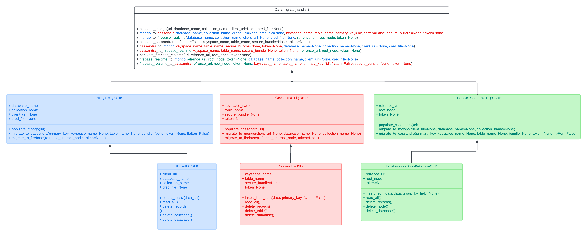

## 1. Introduction

### 1.1 Why this Low-Level Design Document?
The purpose of this Low-Level Design (LLD) Document is to provide a comprehensive and detailed technical blueprint for the Datamigrato project. This document is intended for advanced users, developers, and stakeholders involved in the system's implementation and deployment. It will serve as a guide to ensure the correct and efficient implementation of Datamigrato, detailing its purpose, features, technical requirements, data flow, deployment strategy, performance metrics, and key performance indicators (KPIs).

Datamigrato is a Python library designed to facilitate seamless data migration between diverse database systems. By automating complex operations such as schema conversion, CRUD operations, and secure connection management, Datamigrato aims to streamline the ETL (Extract, Transform, Load) process, ensuring data integrity and optimized transfer. This document will provide an in-depth look at the system's architecture, components, and technical specifications, serving as a crucial reference for the development and maintenance of Datamigrato.

### 1.2 Scope
The scope of this project is to develop Datamigrato, a Python library that facilitates seamless data migration across multiple database systems. Datamigrato aims to address the complexities and challenges associated with data migration, such as schema conversions, CRUD operations, and secure connection management. The library supports various databases, including Cassandra, MongoDB, Firebase Realtime Database, and Firestore, making it a versatile solution for developers and data engineers.

Datamigrato is designed to be a robust and scalable ETL pipeline that simplifies the data migration process with minimal manual intervention. It offers a modern and efficient solution to traditional data migration methods, significantly reducing the potential for errors and data loss. Key features of Datamigrato include:
- **Database Adapters**: These classes manage database-specific connections and CRUD operations. Each supported database has its own adapter (e.g., `CassandraAdapter`, `MongoDBAdapter`).
- **Data Migrators**: These classes orchestrate the end-to-end migration process between specific database pairs (e.g., `MongoToCassandraMigrator`).
- **Common Utilities**: These are reusable functions for tasks such as data transformation, credential management, and logging.
- **Custom Exception Handling**: Enhanced error reporting and debugging capabilities.

The primary objectives of Datamigrato are:
- **Automate ETL Processes**: Automate the extraction, transformation, and loading (ETL) processes for different database systems.
- **Ensure Data Integrity**: Ensure seamless schema conversion and data integrity during migration.
- **Manage Secure Connections**: Manage secure connections and credentials for multiple database systems.
- **CI/CD Integration**: Integrate with CI/CD pipelines to automate quality assurance and testing of migrations.
- **Comprehensive Logging and Error Handling**: Provide comprehensive logging and error handling to track and debug migration processes.
- **Scalability and Performance**: Handle large datasets efficiently and optimize performance for data migrations.

Datamigrato is implemented as a PyPI package and can also be integrated into backend systems, making it flexible and easy to deploy in various environments. The system is designed to be compatible with cloud platforms such as AWS, Azure, and GCP, offering scalability and flexibility in managing resources. Additionally, Datamigrato's modular design ensures maintainability and reusability, making it a valuable tool for ongoing data migration needs.

By focusing on these objectives, Datamigrato aims to provide developers and data engineers with a powerful, reliable, and efficient solution for managing data migrations across diverse database environments.

## 2. Structures

### 2.1 Project Structure
Datamigrato is organized into a modular structure to ensure maintainability and scalability. The key directories and files are as follows:

```
datamigrato/
├── adapters/
│   ├── cassandra_adapter.py
│   ├── firebase_realtime_adapter.py
│   ├── mongodb_adapter.py
├── migration/
│   ├── cassandra_migrator.py
│   ├── firebase_realtime_migrator.py
│   ├── mongodb_migrator.py
├── utils/
│   ├── common_utils.py
├── datamigrato_handler.py
├── __init__.py
```

1. **Adapters**: Contains database-specific classes for handling CRUD operations.
2. **Migration**: Contains classes that orchestrate the migration process between specific database pairs.
3. **Utils**: Contains utility functions for common operations.
4. **Handler**: The main interface for the library.

### 2.2 Architecture Overview

#### Adapters Folder
This is where the magic starts. Each database we work with has its own adapter, responsible for establishing connections and performing base operations. For instance, the MongoDB adapter contains all the necessary logic for connecting to MongoDB and handles the CRUD operations. Think of these adapters as the bridge between Datamigrato and the database.

**Example Code Snippet - MongoDB Adapter**:
```python
class MongoDB_CRUD:
    def __init__(self, database_name, collection_name, client_url=None, cred_file=None):
        # Initialize connection to MongoDB
        self.client = MongoClient(client_url)
        self.db = self.client[database_name]
        self.collection = self.db[collection_name]

    def create_many(self, data_list):
        # Insert multiple documents into MongoDB collection
        self.collection.insert_many(data_list)
```

#### 2.2 Migrators Folder
Here, you'll find migration files for each database. These files are loaded with logic for populating databases, converting schemas, handling primary keys, implementing DSA algorithms, and more. Each migrator class taps into the adapter module to execute migration logic. For example, the Mongo migrator file outlines how to migrate data from MongoDB to other databases, such as Cassandra, using the Cassandra adapter to facilitate data transfer.

**Example Code Snippet - MongoDB to Cassandra Migrator**:
```python
class Mongo_migrator:
    def __init__(self, database_name, collection_name, client_url=None, cred_file=None):
        # Initialize MongoDB Adapter
        self.mongo_adapter = MongoDB_CRUD(database_name, collection_name, client_url, cred_file)

    def migrate_to_cassandra(self, keyspace_name, table_name, secure_bundle=None, token=None):
        # Fetch data from MongoDB
        data = self.mongo_adapter.read_all()
        # Initialize Cassandra Adapter and insert data
        cassandra_adapter = CassandraCRUD(keyspace_name, table_name, secure_bundle, token)
        cassandra_adapter.insert_json_data(data)
```

#### 2.2 Handler Class
This is essentially the command center, orchestrating the migration from one database to another. It’s where all the action is coordinated.

**Example Code Snippet - Datamigrato Handler**:
```python
class Datamigrato:
    def mongo_to_cassandra(self, database_name, collection_name, keyspace_name, table_name, client_url=None, cred_file=None, secure_bundle=None, cassandra_token=None):
        # Initialize MongoDB Migrator
        migrator = Mongo_migrator(database_name, collection_name, client_url, cred_file)
        # Perform migration to Cassandra
        migrator.migrate_to_cassandra(keyspace_name, table_name, secure_bundle, cassandra_token)
```

#### 2.2 Utils Folder
This folder contains various utility modules that support the overall functionality of Datamigrato. From data conversions to API calls, these utilities are the unsung heroes that ensure everything runs smoothly.

**Example Code Snippet - Common Utilities**:
```python
class Common_utils:
    def flatten_data(self, data):
        # Code to flatten nested dictionary
        pass

    def read_creds(self, cred_file):
        # Code to read credentials from a YAML file
        pass

    def get_users_freeAPI(self, url):
        # Code to fetch data from a specified API URL
        pass
```

### 2.3 Function Calls

To give you a better grasp, let’s look at the function call logic within our package using the example of migrating data from MongoDB to Cassandra.

#### The Handler Function
- Users initiate a migration by calling the handler, Datamigrato. Parameters for MongoDB (source) and Cassandra (target) are provided.

#### Migration Module Call
- The handler initiates the migration by calling the appropriate migration module, establishing a connection to MongoDB and creating an instance.

#### Connecting Migrator to Adapter
- The MongoDB migrator uses the MongoDB adapter to fetch data from MongoDB.
- The migrator then connects to the Cassandra adapter to insert the fetched data into Cassandra.

## 4 UML Diagram and Workflow

<!-- 
 -->

<!-- Wrap the image with an <a> tag to enable Lightbox2 -->
<a href="../../../src/assets/uml.png" data-lightbox="image-1">
  
</a>

The UML diagram provides a comprehensive overview of the class interactions and method calls involved in the Datamigrato data migration process. Here's a detailed explanation of each component and how they interact with each other.

#### 4.1 Datamigrato Handler
- **Class**: `Datamigrato`
- **Role**: The central command center orchestrating the migration process.
- **Methods**:
  - `populate_mongo(url, database_name, collection_name, client_url=None, cred_file=None)`: Populates a MongoDB collection with data from a URL.
  - `mongo_to_cassandra(database_name, collection_name, client_url=None, cred_file=None, keyspace_name, table_name, primary_key='id', flatten=False, secure_bundle=None, token=None)`: Migrates data from MongoDB to Cassandra.
  - `mongo_to_firebase_realtime(database

_name, collection_name, client_url=None, cred_file=None, refrence_url, root_node, token=None)`: Migrates data from MongoDB to Firebase Realtime Database.
  - `populate_cassandra(url, keyspace_name, table_name, primary_key, flatten=False, secure_bundle=None, token=None)`: Populates a Cassandra table with data from a URL.
  - `cassandra_to_mongo(keyspace_name, table_name, secure_bundle=None, token=None, database_name=None, collection_name=None, client_url=None, cred_file=None)`: Migrates data from Cassandra to MongoDB.
  - `cassandra_to_firebase_realtime(keyspace_name, table_name, secure_bundle=None, token=None, refrence_url, root_node, token=None)`: Migrates data from Cassandra to Firebase Realtime Database.
  - `populate_firebase_realtime(url, refrence_url, root_node, group_by_field=None, token=None)`: Populates Firebase Realtime Database with data from a URL.
  - `firebase_realtime_to_mongo(refrence_url, root_node, token=None, database_name, collection_name, client_url=None, cred_file=None)`: Migrates data from Firebase Realtime Database to MongoDB.
  - `firebase_realtime_to_cassandra(refrence_url, root_node, token=None, keyspace_name, table_name, primary_key='id', flatten=False, secure_bundle=None, token=None)`: Migrates data from Firebase Realtime Database to Cassandra.

#### 4.2 Mongo_migrator
- **Role**: Handles the migration logic from MongoDB to other databases.
- **Attributes**:
  - `database_name`
  - `collection_name`
  - `client_url`
  - `cred_file`
- **Methods**:
  - `populate_mongo(url)`: Fetches data from a URL and populates a MongoDB collection.
  - `migrate_to_cassandra(primary_key, keyspace_name=None, table_name=None, bundle=None, token=None, flatten=False)`: Migrates data from MongoDB to Cassandra.
  - `migrate_to_firebase(refrence_url, root_node, token=None)`: Migrates data from MongoDB to Firebase Realtime Database.

#### 4.3 Cassandra_migrator
- **Role**: Handles the migration logic from Cassandra to other databases.
- **Attributes**:
  - `keyspace_name`
  - `table_name`
  - `secure_bundle`
  - `token`
- **Methods**:
  - `populate_cassandra(url)`: Fetches data from a URL and populates a Cassandra table.
  - `migrate_to_mongo(client_url=None, database_name=None, collection_name=None)`: Migrates data from Cassandra to MongoDB.
  - `migrate_to_firebase(refrence_url, root_node, token=None)`: Migrates data from Cassandra to Firebase Realtime Database.

#### 4.4 Firebase_realtime_migrator
- **Role**: Handles the migration logic from Firebase Realtime Database to other databases.
- **Attributes**:
  - `refrence_url`
  - `root_node`
  - `token`
- **Methods**:
  - `populate_firebase_realtime(url)`: Fetches data from a URL and populates Firebase Realtime Database.
  - `migrate_to_mongo(client_url=None, database_name=None, collection_name=None)`: Migrates data from Firebase Realtime Database to MongoDB.
  - `migrate_to_cassandra(primary_key, keyspace_name=None, table_name=None, bundle=None, token=None, flatten=False)`: Migrates data from Firebase Realtime Database to Cassandra.

#### 4.5 MongoDB_CRUD
- **Role**: Handles CRUD operations for MongoDB.
- **Attributes**:
  - `client_url`
  - `database_name`
  - `collection_name`
  - `cred_file`
- **Methods**:
  - `create_many(data_list)`: Inserts multiple documents into a MongoDB collection.
  - `read_all()`: Reads all documents from a MongoDB collection.
  - `delete_records()`: Deletes all records from a MongoDB collection.
  - `delete_collection()`: Drops a MongoDB collection.
  - `delete_database()`: Drops a MongoDB database.

#### 4.6 CassandraCRUD
- **Role**: Handles CRUD operations for Cassandra.
- **Attributes**:
  - `keyspace_name`
  - `table_name`
  - `secure_bundle`
  - `token`
- **Methods**:
  - `insert_json_data(data, primary_key, flatten=False)`: Inserts JSON data into a Cassandra table, optionally flattening nested structures.
  - `read_all()`: Reads all records from a Cassandra table.
  - `delete_records()`: Deletes all records from a Cassandra table.
  - `delete_table()`: Drops a Cassandra table.
  - `delete_database()`: Drops a Cassandra database.

#### 4.7 FirebaseRealtimeDatabaseCRUD
- **Role**: Handles CRUD operations for Firebase Realtime Database.
- **Attributes**:
  - `refrence_url`
  - `root_node`
  - `token`
- **Methods**:
  - `insert_json_data(data, group_by_field=None)`: Inserts JSON data into Firebase Realtime Database, optionally grouping by a specified field.
  - `read_all()`: Reads all data from a Firebase Realtime Database node.
  - `delete_records()`: Deletes all records from a Firebase Realtime Database node.
  - `delete_node()`: Deletes a Firebase Realtime Database node.
  - `delete_database()`: Deletes the entire Firebase Realtime Database.

## 5 Workflow

The UML diagram provides a comprehensive overview of the class interactions and method calls involved in the Datamigrato data migration process. Here’s a detailed technical explanation of the workflow, focusing on migrating data from MongoDB to Cassandra.

### 5.1 User Initiation
- **Action**: The user initiates a migration by calling a method in the `Datamigrato` handler class.
- **Example Method Call**:
```python
datamigrato.mongo_to_cassandra(
    database_name='mongo_db',
    collection_name='mongo_collection',
    keyspace_name='cassandra_keyspace',
    table_name='cassandra_table',
    client_url='mongodb://localhost:27017',
    cred_file='mongo_creds.yaml',
    primary_key='id',
    flatten=False,
    secure_bundle='path/to/secure-connect-bundle.zip',
    token='path/to/token.json'
)
```

### 5.2 Handler Invocation
- **Action**: The `Datamigrato` handler method `mongo_to_cassandra` is invoked with the appropriate parameters.
- **Responsibilities**:
  - Initializes the `Mongo_migrator` instance.
  - Calls the migration method on the `Mongo_migrator` to start the data transfer process.
- **Code Snippet**:
```python
class Datamigrato:
    def mongo_to_cassandra(self, database_name, collection_name, keyspace_name, table_name, client_url=None, cred_file=None, primary_key='id', flatten=False, secure_bundle=None, token=None):
        print("---Migrating from MongoDB to Cassandra---")
        migrator = Mongo_migrator(database_name, collection_name, client_url, cred_file)
        migrator.migrate_to_cassandra(keyspace_name, table_name, secure_bundle, token, primary_key, flatten)
```

### 5.3 Mongo_migrator Initialization
- **Action**: The `Mongo_migrator` is initialized with the MongoDB connection details.
- **Responsibilities**:
  - Establishes a connection to the MongoDB collection using the `MongoDB_CRUD` class.
  - Fetches all documents from the specified MongoDB collection.
- **Code Snippet**:
```python
class Mongo_migrator:
    def __init__(self, database_name, collection_name, client_url=None, cred_file=None):
        self.mongo_adapter = MongoDB_CRUD(database_name, collection_name, client_url, cred_file)
        self.mongo_data_list = self.mongo_adapter.read_all()
```

### 5.4 Data Fetching
- **Action**: The `MongoDB_CRUD` reads all documents from the MongoDB collection.
- **Responsibilities**:
  - Connects to the MongoDB database using the provided credentials and database details.
  - Fetches all documents and provides this data to the `Mongo_migrator`.
- **Code Snippet**:
```python
class MongoDB_CRUD:
    def read_all(self):
        try:
            return list(self.collection.find({}))
        except Exception as e:
            print(f"Read error: {e}")
            return None
```

### 5.5 Cassandra Adapter Initialization
- **Action**: The `Mongo_migrator` initializes the `CassandraCRUD` with the target Cassandra table details.
- **Responsibilities**:
  - Establishes a connection to the Cassandra database using the secure bundle and token.
  - Prepares for data insertion.
- **Code Snippet**:
```python
class CassandraCRUD:
    def __init__(self, keyspace_name, table_name, secure_bundle=None, token=None):
        self.session = self._connect_to_cassandra(keyspace_name, secure_bundle, token)

    def _connect_to_cassandra(self, keyspace_name, secure_bundle, token):
        cloud_config = {'secure_connect_bundle': secure_bundle}
        with open(token) as f:
            secrets = json.load(f)
        auth_provider = PlainTextAuthProvider(secrets["clientId"], secrets["secret"])
        cluster = Cluster(cloud=cloud_config, auth_provider=auth_provider, protocol_version=4)
        return cluster.connect(keyspace_name)
```

### 5.6 Data Insertion


- **Action**: The `Mongo_migrator` calls the `insert_json_data` method of the `CassandraCRUD` to insert the fetched MongoDB data into the Cassandra table.
- **Responsibilities**:
  - Dynamically creates the Cassandra table if it does not exist.
  - Inserts the MongoDB data into the Cassandra table, optionally flattening nested structures.
- **Code Snippet**:
```python
class Mongo_migrator:
    def migrate_to_cassandra(self, keyspace_name, table_name, secure_bundle=None, token=None, primary_key='id', flatten=False):
        cassandra_adapter = CassandraCRUD(keyspace_name, table_name, secure_bundle, token)
        data = self.mongo_data_list
        cassandra_adapter.insert_json_data(data, primary_key, flatten)

class CassandraCRUD:
    def insert_json_data(self, data, primary_key='id', flatten=False):
        for record in data:
            if flatten:
                record = self.common_utils.flatten_data(record)
            placeholders = ', '.join(['%s' for _ in record])
            columns = ', '.join(record.keys())
            query = f"INSERT INTO {self.keyspace_name}.{self.table_name} ({columns}) VALUES ({placeholders})"
            self.create(query, tuple(record.values()))

    def create(self, query, parameters=None):
        try:
            self.session.execute(query, parameters)
        except Exception as e:
            print(f"An error occurred during insertion: {e}")
```

### 5.7 Workflow Breakdown

1. **User Initiation**:
   - The user calls the `Datamigrato` handler method `mongo_to_cassandra` with the necessary parameters.

2. **Handler Invocation**:
   - The `Datamigrato` handler logs the migration start and initializes a `Mongo_migrator` instance.
   - The handler then calls the `migrate_to_cassandra` method on the `Mongo_migrator`.

3. **Mongo_migrator Initialization**:
   - The `Mongo_migrator` constructor is called with MongoDB connection details.
   - It initializes the `MongoDB_CRUD` adapter to establish a connection to the MongoDB collection.
   - The `MongoDB_CRUD` reads all documents from the collection and stores them in `mongo_data_list`.

4. **Data Fetching**:
   - The `MongoDB_CRUD` fetches all documents from MongoDB using the `find` method.
   - It returns the documents as a list of dictionaries to the `Mongo_migrator`.

5. **Cassandra Adapter Initialization**:
   - The `migrate_to_cassandra` method of the `Mongo_migrator` initializes the `CassandraCRUD` adapter.
   - The `CassandraCRUD` adapter establishes a connection to the Cassandra keyspace and table.

6. **Data Insertion**:
   - The `migrate_to_cassandra` method passes the fetched MongoDB data to the `CassandraCRUD` adapter.
   - The `CassandraCRUD` adapter checks if the table exists; if not, it creates the table dynamically.
   - It then iterates over the MongoDB data, optionally flattens nested structures, and inserts each record into the Cassandra table using `INSERT` queries.

By following these steps, Datamigrato ensures a seamless and efficient migration of data from MongoDB to Cassandra, leveraging its modular architecture and clearly defined responsibilities for each component.


## 6 Integration and Deployment with CI/CD

Datamigrato leverages Continuous Integration and Continuous Deployment (CI/CD) pipelines to ensure code quality, reliability, and automated deployment. The CI/CD process involves code checking, linting, testing, and publishing the package to PyPI.

### 6.1 CI/CD Workflow

#### 1. Continuous Integration (CI) Workflow

The CI workflow is defined in the `ci.yaml` file. It is triggered on every push to the master branch and on pull requests. The workflow includes steps for setting up the environment, installing dependencies, running tests, and performing linting checks.

**ci.yaml Overview**:

**Key Steps**:

1. **Set up Python**:
   ```yaml
   - name: Set up Python
     uses: actions/setup-python@v3
     with:
       python-version: "3.8"
   ```

2. **Install Dependencies**:
   ```yaml
   - name: Install dependencies
     run: |
       python -m pip install --upgrade pip
       pip install flake8 pytest requests
       pip install -r requirements.txt
   ```

3. **Run Docker Container**:
   ```yaml
   - name: Run Docker container
     run: |
       docker run -d --name my_freeapi_container --env MONGODB_URI='${{ secrets.MONGO_CLIENT_URL }}' -p 8080:8080 ritikdutta/freeapi_forked:latest
       sleep 20
   ```

4. **Run Pytest**:
   ```yaml
   - name: Run Pytest
     env:
       MONGO_CLIENT_URL: ${{ secrets.MONGO_CLIENT_URL }}
     run: |
       pytest tests/test_unit.py 
   ```

#### 2. Continuous Deployment (CD) Workflow

The CD workflow is defined in the `python-publish.yml` file. It is triggered when a new release is published. The workflow builds and publishes the package to PyPI.

**python-publish.yml Overview**:

**Key Steps**:

1. **Set up Python**:
   ```yaml
   - name: Set up Python
     uses: actions/setup-python@v3
     with:
       python-version: '3.8'
   ```

2. **Install Dependencies**:
   ```yaml
   - name: Install dependencies
     run: |
       python -m pip install --upgrade pip
       pip install flake8 pytest
       pip install -r requirements.txt
       pip install build
   ```

3. **Lint with flake8**:
   ```yaml
   - name: Lint with flake8
     run: |
       flake8 . --count --select=E9,F63,F7,F82 --show-source --statistics
       flake8 . --count --exit-zero --max-complexity=10 --max-line-length=127 --statistics
   ```

4. **Publish Package**:
   ```yaml
   - name: Publish package
     uses: pypa/gh-action-pypi-publish@27b31702a0e7fc50959f5ad993c78deac1bdfc29
     with:
       user: __token__
       password: ${{ secrets.PYPI_API_TOKEN }}
   ```

### 6.2 Testing

Testing is an integral part of the CI pipeline. The tests are defined in the `test_mongodb_migrator.py` file, which first populates the MongoDB database, then migrates the data from MongoDB to Cassandra.

**test_mongodb_migrator.py Overview**:

**Key Steps**:

1. **Initialization**:
   ```python
   class Test:
       def __init__(self, url, database_name, collection_name, keyspace_name, table_name, primary_key, flatten=False, client_url=None, cred_file=None, secure_bundle=None, cassandra_token=None):
           self.handler = Datamigrato()
           self.url = url
           self.database_name = database_name
           self.collection_name = collection_name
           self.keyspace_name = keyspace_name
           self.table_name = table_name
           self.primary_key = primary_key
           self.flatten = flatten
           self.client_url = client_url
           self.cred_file = cred_file
           self.secure_bundle = secure_bundle
           self.cassandra_token = cassandra_token
   ```

2. **Populate MongoDB**:
   ```python
   def populate_mongo(self):
       self.handler.populate_mongo(url=self.url, database_name=self.database_name, collection_name=self.collection_name, client_url=self.client_url, cred_file=self.cred_file)
       assert True
   ```

3. **Migrate from MongoDB to Cassandra**:
   ```python
   def mongo_to_cassandra(self):
       self.handler.mongo_to_cassandra(database_name=self.database_name, collection_name=self.collection_name, client_url=self.client_url, cred_file=self.cred_file, keyspace_name=self.keyspace_name, table_name=self.table_name, primary_key=self.primary_key, flatten=self.flatten, secure_bundle=self.secure_bundle, cassandra_token=self.cassandra_token)
       assert True
   ```

**Full Test Class**:
```python
from datamigrato.handler.datamigrato_handler import Datamigrato

class Test:
    def __init__(self, url, database_name, collection_name, keyspace_name, table_name, primary_key, flatten=False, client_url=None, cred_file=None, secure_bundle=None, cassandra_token=None):
        self.url = url
        self.database_name = database_name
        self.collection_name = collection_name
        self.keyspace_name = keyspace_name
        self.table_name = table_name
        self.primary_key = primary_key
        self.flatten = flatten
        self.client_url = client_url
        self.cred_file = cred_file
        self.secure_bundle = secure_bundle
        self.cassandra_token = cassandra_token

        self.handler = Datamigrato()
        self.populate_mongo()
        self.mongo_to_cassandra()

    def populate_mongo(self):
        self.handler.populate_mongo(url=self.url, database_name=self.database_name, collection_name=self.collection_name, client_url=self.client_url, cred_file=self.cred_file)
        assert True

    def mongo_to_cassandra(self):
        self.handler.mongo_to_cassandra(database_name=self.database_name, collection_name=self.collection_name, client_url=self.client_url, cred_file=self.cred_file, keyspace_name=self.keyspace_name, table_name=self.table_name, primary_key=self.primary_key, flatten=self.flatten, secure_bundle=self.secure_bundle, cassandra_token=self.cassandra_token)
        assert True
```

### 6.4 CICD Conclusion

The CI/CD workflows for Datamigrato ensure that the code is checked, linted, tested, and published in a reliable and automated manner. This process helps maintain code quality, ensures proper functionality, and automates the deployment of the package to PyPI. The integration with Docker allows for consistent testing environments, and the use of pytest ensures that the code is thoroughly tested before deployment.


## Conclusion

The Low-Level Design (LLD) documentation for Datamigrato provides a detailed and technical blueprint for the development and implementation of this Python library. By detailing the project structure, architecture, and workflows, including the CI/CD integration, this document serves as a comprehensive guide for developers and stakeholders. The CI/CD pipelines ensure rigorous code quality checks, automated testing, and seamless deployment, which collectively contribute to the reliability and efficiency of Datamigrato. This robust design and automated process not only enhance the ease of data migration across diverse database systems but also ensure maintainability, scalability, and performance optimization for future development and deployment needs.