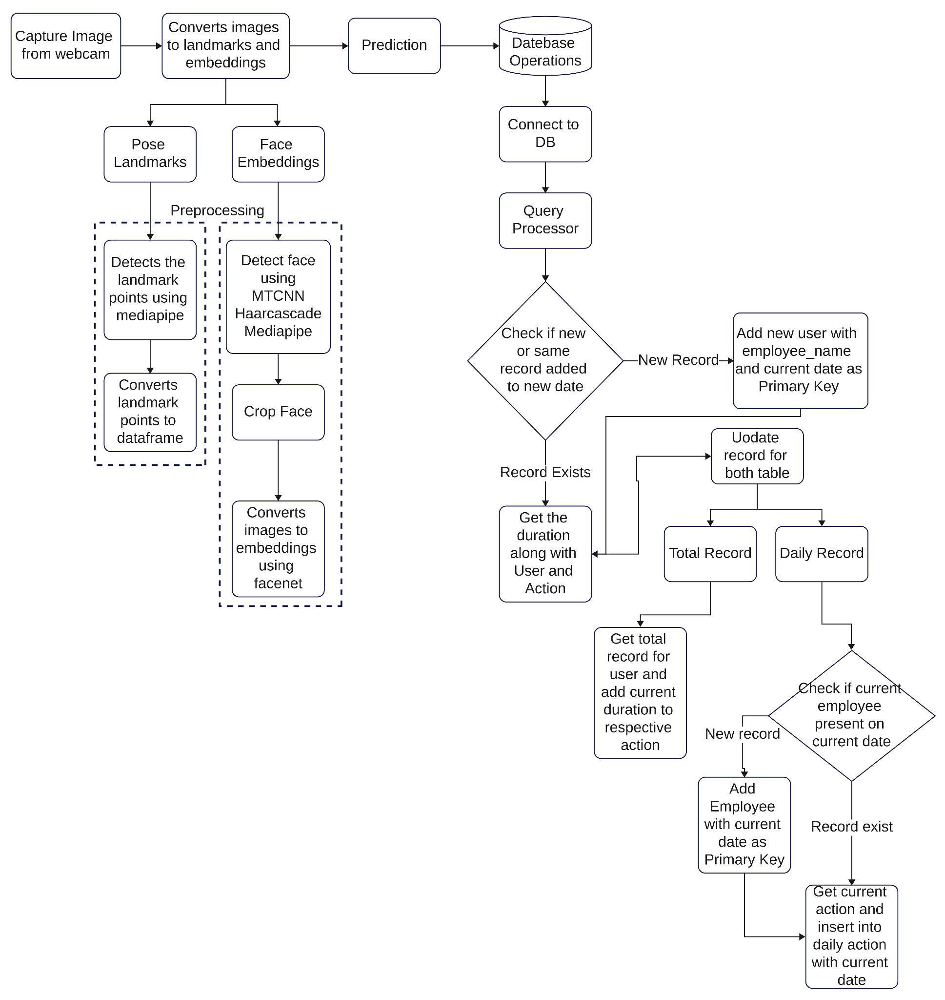
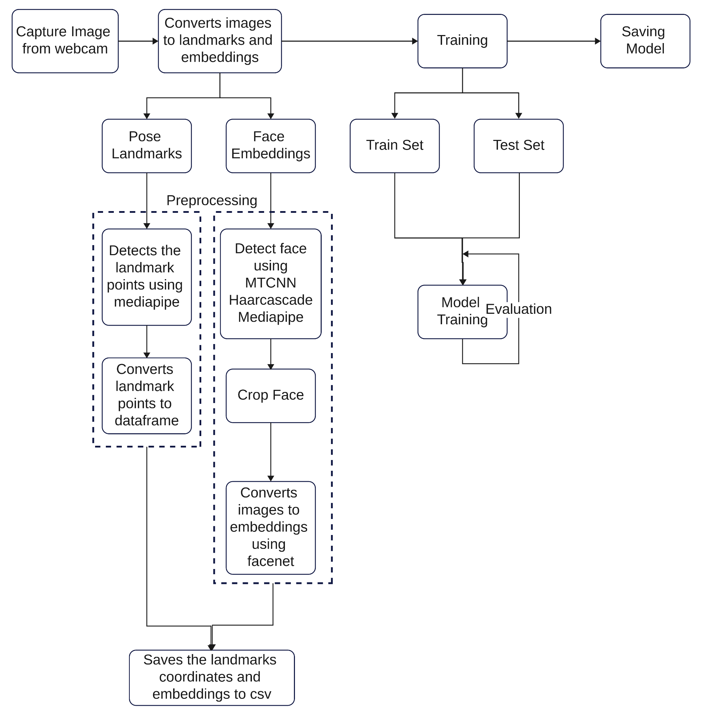
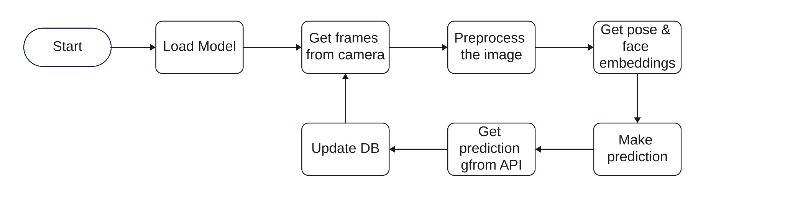

## 1. Process Flow

**Start:**
- The process initiates with the system capturing images from the webcam. This step involves utilizing JavaScript functions like `getUserMedia()` to access the webcam stream and retrieve frames for further processing.

### 1.1 Convert Images to Landmarks and Embeddings

**i. Pose Landmarks:**
- The system employs the **MediaPipe** library, which provides a collection of pre-trained models and APIs specifically designed for body pose estimation.
- Leveraging these models, the system accurately detects and localizes various landmark points on the user's body. These landmark points correspond to essential joints and body parts, including wrists, elbows, and shoulders.
- The detected landmark points are then extracted and processed to generate a structured representation, often in the form of a dataframe. This structured data facilitates convenient manipulation and analysis for subsequent stages of the system.

**ii. Face Embeddings:**
- To enable face recognition and extract facial features, the system utilizes a combination of techniques and algorithms.
- Firstly, the system employs the **MTCNN (Multi-task Cascaded Convolutional Networks)** algorithm, which specializes in face detection. This algorithm efficiently identifies facial regions within the captured images.
- In addition to MTCNN, the system utilizes **Haar cascade classifiers**, which are effective in detecting faces based on specific visual patterns.
- The **MediaPipe** library further contributes to facial feature detection and tracking, enhancing the accuracy and reliability of the system.
- Once the face region is successfully localized, it undergoes a cropping process to isolate the face area.
- The cropped face image is then fed into a deep learning model called **FaceNet**. Trained on a vast dataset of faces, FaceNet extracts high-dimensional embeddings from the face images. These embeddings serve as compact representations, encoding unique facial characteristics and enabling efficient face recognition.

### 1.2 Prediction

- The extracted pose landmarks and face embeddings act as the input for the prediction tasks performed by the system.
- Various machine learning models can be employed for these prediction tasks, such as **XGBoost**, **Random Forest**, or even deep learning architectures like convolutional neural networks (CNNs).
- These models are trained on labeled datasets, allowing them to learn and associate specific poses or facial features with particular actions or attributes.
- Through the prediction process, the system can infer valuable information from the input data and generate meaningful results.

### 1.3 Database Operations

1. **Connect to Database:**
    - The system establishes a connection to a database management system (DBMS) such as **MySQL**, **PostgreSQL**, or **MongoDB**.
    - This connection allows the system to interact with the database efficiently, performing data storage, retrieval, and manipulation operations.

2. **Query Processor:**
    - The system processes queries to interact with the database effectively.
    - These queries can include retrieving existing records, updating records with new information, or inserting new data into the appropriate tables.

3. **If Record Exists:**
    - The system checks whether a record already exists in the database, typically based on user and action identifiers.

**i. Record Exists:**
    - If the record already exists, the system performs specific operations based on the business logic.
    - For example, it may calculate the duration of the current action by comparing timestamps or perform aggregations on historical data.
    - These operations allow the system to derive meaningful insights from the existing records and provide valuable metrics or analytics.

**ii. New Record:**
    - If it's a new record, the system adds a new user entry to the user table, typically including the employee name and the current date as the primary key.
    - The system then updates the record in both the user and action tables, storing relevant information such as timestamps and details of the current action.

4. **Total Record:**
    - The system retrieves the total number of records associated with a particular user, providing insights into their overall activity or performance.

5. **Daily Record:**
    - The system checks if the employee is present in the current date's daily record table.
    - If the record exists, the system retrieves the current action and inserts it into the daily action table along with the current date.
    - This process allows the system to maintain a comprehensive log of daily actions performed by each employee.

**End:**
- The process flow concludes, having successfully executed the architecture of the computer vision system.
- The system effectively captures images from the webcam, processes them to extract pose landmarks and face embeddings, performs predictions based on the extracted features, and stores relevant data in a database for further analysis, reporting, or other business requirements.

## 2. Training Flow

**Start:**
- The process initiates with the system capturing images from the webcam. This step involves utilizing JavaScript functions like `getUserMedia()` to access the webcam stream and retrieve frames for further processing.

### 2.1 Convert Images to Landmarks and Embeddings

**i. Pose Landmarks:**
- The system employs the **MediaPipe** library, which provides a collection of pre-trained models and APIs specifically designed for body pose estimation.
- Leveraging these models, the system accurately detects and localizes various landmark points on the user's body. These landmark points correspond to essential joints and body parts, including wrists, elbows, and shoulders.
- The detected landmark points are then extracted and processed to generate a structured representation, often in the form of a dataframe. This structured data facilitates convenient manipulation and analysis for subsequent stages of the system.

**ii. Face Embeddings:**
- To enable face recognition and extract facial features, the system utilizes a combination of techniques and algorithms.
- Firstly, the system employs the **MTCNN (Multi-task Cascaded Convolutional Networks)** algorithm, which specializes in face detection. This algorithm efficiently identifies facial regions within the captured images.
- In addition to MTCNN, the system utilizes **Haar cascade classifiers**, which are effective in detecting faces based on specific visual patterns.
- The **MediaPipe** library further contributes to facial feature detection and tracking, enhancing the accuracy and reliability of the system.
- Once the face region is successfully localized, it undergoes a cropping process to isolate the face area.
- The cropped face image is then fed into a deep learning model called **FaceNet**. Trained on a vast dataset of faces, FaceNet extracts high-dimensional embeddings from the face images. These embeddings serve as compact representations, encoding unique facial characteristics and enabling efficient face recognition.

### 2.2 Training

- The training phase involves splitting the data into training and test sets for model evaluation.

**i. Training Set:**
    - The training set consists of a subset of the captured images and their corresponding labeled data.
    - This labeled data serves as the ground truth, providing the expected outputs for the training process.

**ii. Test Set:**
    - The test set comprises a separate subset of the captured images and their corresponding labels.
    - This set is used to evaluate the trained model's performance and assess its ability to generalize to unseen data.

### 2.3 Model Training

- The system applies various machine learning algorithms or deep learning architectures to train the model.
- The model learns to associate the input images with the provided labels, aiming to accurately predict the corresponding pose or facial attributes.

### 2.4 Evaluation

- Once the model is trained, it undergoes evaluation using the test set.
- The system assesses the model's performance metrics, such as accuracy, precision, recall, or F1 score, to determine its effectiveness in predicting pose or facial attributes.

### 2.5 Saving Model

- After the model training and evaluation stages, the trained model is saved for future use.
- The saved model can be loaded and utilized for real-time inference or further analysis.

**End:**
- The training flow architecture concludes, having successfully trained a model capable of predicting pose or facial attributes based on captured images.
- The trained model can be integrated into the overall computer vision system, enabling real-time pose estimation, face recognition, or other relevant applications.

## 3 Development Flow

**Start:**
- The training flow begins.

### 3.1 Load Model

- The pre-trained model is loaded into memory to perform predictions on the captured frames.

### 3.2 Get Frames from Camera

- The system captures frames from the camera in real-time.

### 3.3 Preprocess the Image

- The captured frame undergoes preprocessing steps to enhance the quality and prepare it for further analysis.
- Preprocessing techniques may include resizing, normalization, or filtering.

### 3.4 Get Pose and Face Embeddings

- The preprocessed frame is processed to extract pose and face embeddings.

**a. Pose:**
    - The system uses pose estimation techniques to detect and track the user's body pose.
    - Pose landmarks are extracted, representing specific points on the user's body.

**b. Face:**
    - The system utilizes face detection algorithms, such as **MTCNN** or **Haarcascade**, to locate and extract faces from the frame.
    - The extracted face regions are then processed to generate face embeddings, which capture the unique features of each face.

### 3.5 Make Prediction

- The pose and face embeddings are passed through the trained model to make predictions.

### 3.6 Get Prediction Results from API

- The system communicates with an external API or backend to obtain the prediction results.
- This API or backend may perform additional processing or analysis on the predicted results.

### 3.7 Update Database

- The prediction results, along with relevant information such as timestamps, are stored in a database.
- The database is updated with the latest prediction data, allowing for future analysis or retrieval.

### 3.8 Loop to Get Frames from Camera

- The process repeats, capturing new frames from the camera, preprocessing them, extracting pose and face embeddings, making predictions, and updating the database.

