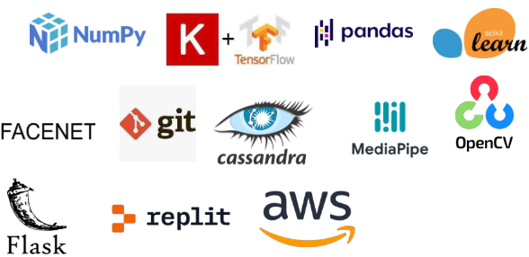
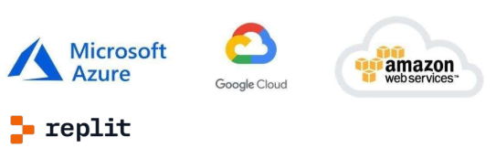

## Abstract

Inefficient employee attendance systems often fail to accurately track individual employee activities, which can make it challenging to evaluate employee performance and provide appropriate promotions. To address this issue, we propose the development of an advanced computer vision system named "Company Work Environment Management." This system creates attendance records based on employee arrival and departure times, as well as tracking individual activities throughout the day, such as working, talking on the phone, or looking away from their system.

One of the most significant aspects of this system is its commitment to data privacy, as it only collects mathematical representations of employee data, which can be used for prediction and model evaluation but cannot be used to recreate the original images or faces. This project aims to enhance the accuracy and efficiency of employee attendance systems, making it easier to evaluate employee performance and provide appropriate promotions.

## 1. Introduction

### 1.1 Why this High-Level Design Document?

The purpose of this High-Level Design (HLD) Document is to add the necessary detail to the current project description to represent a suitable model for coding. This document is also intended to help detect contradictions prior to coding and can be used as a reference manual for how the modules interact at a high level.

The HLD will:
1. Present all of the design aspects and define them in detail
2. Describe the user interface being implemented
3. Describe the hardware and software interfaces
4. Describe the performance requirements
5. Include design features and the architecture of the project
6. List and describe the non-functional attributes like:
   - Security
   - Reliability
   - Maintainability
   - Portability
   - Reusability
   - Application compatibility
   - Resource utilization
   - Serviceability

### 1.2 Scope

The HLD documentation presents the structure of the system, such as the database architecture, application architecture (layers), application flow (Navigation), and technology architecture. The HLD uses non-technical to mildly-technical terms which should be understandable to the administrators of the system.

## 2. General Description

### 2.1 Project Perspective

The proposed computer vision system, named "Company Work Environment Management", uses advanced face recognition technology to improve employee attendance tracking and performance evaluation. It also utilizes a Cassandra NoSQL database to store and analyze employee activity data. The system offers a modern and efficient solution to traditional attendance tracking and enhances the overall work environment management process. The system uses Machine learning for predictions and Deep Learning for detection.

### 2.2 Problem Statement

To create an AI Solution for Employee work and attendance and activity tracker we need to implement the following use cases:
- To detect faces and classify them and add them to record.
- To identify pose and classify them into predefined activities like talking on phone, looking away from screen, working, etc.
- Manages a database with daily as well as total activity records.

### 2.3 Proposed Solution

#### Data collection Face

**Version 1:**

For data collection, the solution proposed here is using mediapipe to get the coordinates of facial landmarks which consist of 468 3D face landmarks. The landmarks consist of x,y,z coordinates of individual features of the face along with visibility confidence. And store them on a csv file for training. The idea here is using these coordinates to train a model with these data points along with labels.

**Version 2:**

For data collection, the solution proposed here is using a computer vision system to detect a face using Mtcnn or Dllib and crop the faces from the rest of the background and get the facial embeddings using facenet to get the mathematical representations of facial features and save the embeddings on csv.

For face detection libraries can be used:

**MTCNN:**
Mtcnn detects the face in three stages to acquire greater confidence and accuracy but with the tradeoff of requiring more computational power.

**HaarCascade:**
HaarCascase requires less computational power hence they are faster but they tend to give some False Positives.

**Getting Embeddings:**
We can use the facenet library on cropped faces to get face embeddings.

For training:

**Artificial Neural Network (ANN):**
- Pros: ANNs can learn highly complex relationships, and can achieve high accuracy. They can generalize well to new data and are well suited for data with high dimensions.
- Cons: ANNs can be computationally expensive and require more processing power hence real-time prediction can’t be achieved. They are prone to overfitting and can be trained on noise of complex data.

**K-nearest Neighbors (KNN):**
- Pros: KNN compares the current tuple of the dataset (face in our case) to each face in the registry and outputs the most similar face, which can be an ideal solution for the problem.
- Cons: KNN is a non-trainable model and calculates the distances at the time of prediction which can be computationally slow when more faces are present in the registry.

**Support Vector Machine (SVM):**
- Pros: SVMs can work well for problems involving distance metrics. They are commonly used in classification tasks where the goal is to separate data points into different classes or categories. SVMs are lightweight for prediction because they only have to calculate for k numbers (number of data points that can separate the classified group) of data points defined at the time of training. They have less tradeoff between accuracy and performance.

#### Data Collection for Pose

**Mediapipe:**
Mediapipe pose landmarks contain 33 3D landmarks for individual points just like face mesh. Consist of X,Y,Z, visibility confidence which are then stored on csv file along with class name.

Training: ANN, KNN, and SVM can also be used here with their performances and accuracy tradeoff keeping in mind.

#### Hosting

Before the prediction part, we first need to host the web application that runs preprocess the testing (live) data and sends the data for prediction.

We will create a Flask web application with python and javascript to capture the webcam for Face > Pose > Preprocessing > Prediction > Database Management pipeline.

We can use such hosting platforms:
- Amazon Web Services (AWS)
- Microsoft Azure
- Heroku
- Replit

#### Data Collection for Prediction

**Face:**

**Version 1:**

We detect landmarks using Mediapipe pose library and sent the landmarks tuple for prediction without storing real image.

**Version 2:**

We first detect the face coordinates with MTCNN or Dllib and crop the required by facenet to get embeddings and sent the embeddings tuple for prediction.

For face detection libraries can be used:

**MTCNN:**
Mtcnn detects the face in three stages to acquire greater confidence and accuracy but with the tradeoff of requiring more computational power.

**HaarCascade:**
HaarCascase requires less computational power hence they are faster but they tend to give some False Positives.

**Getting Embeddings:**
We can use the facenet library on cropped faces to get face embeddings.

**Database:**

Once the prediction result is obtained, it is sent to the database pipeline along with the duration. The database pipeline follows a basic structure:

1. After getting the prediction result, check if the pose or face is not updating.
2. Calculate the duration for the current pose for the same face and keep track of the duration.
3. When the user performs the next pose or the face changes, then add the previous pose along with face (user name) and duration the user performed before the current action.
4. Check if the user is present for today's record table and update or add new records accordingly with the current date and time.
5. For every action performed, update the record of the user with adding the duration calculated before new prediction and sum that up on that pose column.
6. Update the "end time" column to indicate the time when the last record was captured, after which no further records will be added to the end time column.
7. Update the Total record table with the total duration of actions performed by the user every day.
8. In summary, the database pipeline ensures accurate tracking and recording of user actions and durations, while also updating relevant tables in the database.

### 2.4 Further Improvements

Ability to capture employee emotions. This feature can be useful in ensuring that employees are happy and satisfied with their work environment. By analyzing facial expressions, the system can identify when an employee is feeling stressed or unhappy and alert management to take appropriate action. This can include providing additional support, changing work assignments, or addressing any other issues that may be affecting employee happiness. Capturing emotions can also help identify areas where the work environment could be improved to enhance employee satisfaction and productivity. Additionally, analyzing emotions can enable management to identify employees who may be at risk of burnout or other mental health issues and take proactive measures to address these concerns. Overall, this feature can enhance the system's ability to promote employee well-being and job satisfaction.

### 2.5 Technical Requirement

The technical requirements for the proposed computer vision system are as follows:

**Hardware:** The system will require a camera and a computer with decent performance. The camera should have a resolution of at least 720p and a decent frame rate to capture accurate facial data.

**Software:** No Software needed as such for the Main application, just a web browser that needs to serve a weblink. But for Debug and training such requirements needed:
- OpenCV: An open-source computer vision library for image and video processing.
- TensorFlow: Machine learning and deep learning frameworks for building models for pose estimation, face recognition, and emotion detection.
- Cassandra NoSQL database: A distributed NoSQL database for storing and analyzing employee activity data.
- Flask: A micro web framework for building a REST API for the system.
- Pose Estimation Model: The system will require a pose estimation model to detect and track employee poses. The model should be accurate and able to detect a range of poses, including sitting, standing, and walking.
- Face Recognition Model: The system will require a face recognition model to identify employees based on their facial features. The model should be able to accurately recognize employees in various lighting conditions and angles.

### 2.6 Data Requirements

- **Employee Data:** The system will require a database of employee data, including names, photographs, and any other relevant information needed for face recognition. This data will be used to train the face recognition model and for identification of employees.
- **Pose Data:** The system will capture pose data for employees, including sitting, standing, and walking. This data will be used to train the pose estimation model and for tracking employee activity.
- **Attendance Data:** The system will capture attendance data for each employee, including the time they arrived and left the workplace. This data will be used for attendance tracking and performance evaluation.
- **Activity Data:** The system will capture activity data for each employee, including the duration of each pose and the total duration of each activity. This data will be used for performance evaluation and for identifying areas where employees may need additional support or training.
- **System Data:** The system will capture and store system data, such as errors and usage logs. This data can be used to monitor and improve system performance and identify issues that may affect employee attendance tracking or activity analysis.

### 2.7 Tools used

- AWS, Replit is used for deployment of the model.
- Cassandra is used for database operations.
- Front end development is done using HTML/CSS.
- Python Flask is used for backend development.
- GitHub is used as version control system.

### 2.8 Constraints

The Company Work Environment system must be user friendly, as automated as possible and users should not be required to know any of the workings. The System should not collect or store any personal data (like face images). It can only collect data points and face embeddings for training and predictions.

### 2.9 Assumptions

The main objective of the project is to implement the use cases as previously mentioned (2.2 Problem Statement) for a new dataset that comes through a system which has a camera installed for capturing the live videos. Deep Learning based face and pose detection as well as classification model is used for detecting and classifying the above-mentioned use cases based on the input data. It is also assumed that all aspects of this project have the ability to work together in a way the designer is expecting.

## 3. Performance

Our proposed computer vision system, "Company Work Environment Management," performs with the following performance requirements:

1. **Real-Time Processing:** Our system processes employee poses and facial data in real-time, recognizing employees and tracking their poses within a few seconds of the action taking place. The system provides fast feedback to the user, enabling them to monitor and manage employee attendance and activity in real-time.
2. **High Accuracy:** Our system has a high level of accuracy in recognizing employees, detecting faces. It is continuously trained and optimized to improve accuracy, adapting to changes in employee behavior and environmental conditions.
3. **Scalability:** Our system is designed to handle a large number of employees and data. It can handle an increase in the number of employees and data without affecting the performance or accuracy of the system. This makes it scalable to meet the growing demands of our customers.
4. **Robustness:** Our system is robust, able to handle variations in lighting conditions, employee poses, and facial data. It can detect and handle errors and exceptions to ensure that the system is reliable and consistent.
5. **User Interface:** Our system has an easy-to-use and navigable user interface. The system provides real-time analytics, database tables, and reports that are easy to understand and interpret. This enables users to monitor and manage employee attendance and activity with ease.
6. **Security:** Our system has robust security measures in place to protect employee data and ensure employee privacy. We employ industry-standard security protocols to ensure the safety and privacy of our users' data.

Overall, our proposed computer vision system, "Company Work Environment Management," performs with high accuracy, scalability, robustness, and security. The system's real-time processing and easy-to-use user interface make it an efficient solution for managing employee attendance and activity.

### 3.1 Reusability

The reusability of the proposed computer vision system, "Company Work Environment Management," is an important aspect of the system's design. The following points highlight the reusability of our system:

1. **Modular Design:** Our system is designed using a modular approach, making it easy to integrate with other systems. The different components of our system can be easily integrated with other systems, enabling reusability of the system's individual modules.
2. **Open-Source Frameworks:** Our system uses open-source frameworks such as TensorFlow, Keras, Facenet, Mediapipe, and OpenCV. These frameworks have a large community of developers, making it easy to find support and resources for the system. Additionally, the use of open-source frameworks ensures that the system is easily reusable and adaptable.
3. **APIs:** Our system provides APIs that can be used by other systems to integrate with our system. This enables the reusability of our system's functionalities and allows other systems to access and use our system's data.
4. **Cloud-Based Infrastructure:** Our system is designed to run on a cloud-based infrastructure, making it easily scalable and reusable. The cloud-based infrastructure allows our system to be accessed from anywhere, making it a more accessible and reusable solution.
5. **Documented Code:** Our system's code is well documented, making it easier for other developers to understand and reuse the code. The documentation includes code comments, user manuals, and technical guides, making it easier for other developers to understand and use our system's code.

In conclusion, the proposed computer vision system, "Company Work Environment Management," has been designed with reusability in mind. The system's modular design, open-source frameworks, APIs, cloud-based infrastructure, and well-documented code make it a reusable and adaptable solution for managing employee attendance and activity.

### 3.2 Application Compatibility

The application compatibility of the proposed computer vision system, "Company Work Environment Management," is a crucial aspect of the system's design. The following points highlight the application compatibility of our system:

1. **Cross-Platform Compatibility:** Our system is designed to be cross-platform compatible, which means it can be accessed and run on multiple operating systems. This ensures that our system is accessible to a broader audience, regardless of the platform they are using.
2. **Web-Based Application:** Our system is a web-based application, which means it can be accessed through a web browser. This feature makes it easy to access our system from anywhere, provided there is an internet connection.
3. **Mobile Compatibility:** Our system is designed to be compatible with mobile devices, allowing employees to check-in and perform activities using their mobile phones. The mobile compatibility feature makes our system more accessible and user-friendly for employees who are on-the-go.
4. **Scalability:** Our system is designed to be scalable, which means it can be easily adapted and modified to meet the changing needs of the organization. This feature ensures that our system remains compatible with the organization's evolving requirements.

In conclusion, the proposed computer vision system, "Company Work Environment Management," has been designed with application compatibility in mind. The cross-platform compatibility, web-based application, mobile compatibility, and scalability features ensure that our system is compatible with a wide range of devices and IT infrastructures, making it accessible and user-friendly for organizations of all sizes.

### 3.3 Resource Utilization

The resource utilization of the proposed computer vision system, "Company Work Environment Management," is an essential aspect of the system's design. Here are some of the key points that highlight the resource utilization of our system:

1. **Processing Power:** Our system utilizes Machine learning and Deep learning algorithms to perform real-time face recognition and pose detection. These algorithms require significant processing power, and therefore, our system is designed to use high-performance servers to ensure quick and efficient processing of the data.
2. **Storage Capacity:** Our system utilizes a Cassandra NoSQL database to store and analyze employee activity data. This database is designed to handle large volumes of data and offers high scalability, ensuring that our system can store data for extended periods.
3. **Bandwidth:** Our system utilizes a web-based interface and mobile application, which requires a reliable internet connection. The bandwidth requirement of our system is minimal, and our system has been designed to use optimized data transfer protocols to minimize the usage of bandwidth.
4. **Power Consumption:** Our system uses cameras to capture real-time employee data, which requires a constant power supply. Our system is designed to use low-power cameras and to optimize the power consumption of the servers to reduce the overall power consumption of the system.
5. **Maintenance:** Our system requires regular maintenance, including software updates, database backups, and hardware maintenance. Our system is designed to automate many of these maintenance tasks, reducing the need for manual intervention.

In conclusion, the proposed computer vision system, "Company Work Environment Management," has been designed with resource utilization in mind. Our system utilizes high-performance servers, a scalable database, optimized data transfer protocols, low-power cameras, and automated maintenance to ensure efficient and reliable performance while minimizing the usage of resources.

### 3.4 Deployment

The deployment of the proposed computer vision system, "Company Work Environment Management," is a critical aspect of its design. Here are some of the key points that highlight the deployment strategy for our system:

1. **Hardware Requirements:** Our system requires a set of high-performance servers to perform real-time face recognition and pose detection. These servers should have sufficient processing power and memory to handle the load of the system.
2. **Software Requirements:** Our system requires several software components, including a Cassandra NoSQL database, Python libraries for machine learning and deep learning, and web and mobile application development tools.
3. **Cloud Deployment:** Our system can be deployed on cloud platforms such as Amazon Web Services, Microsoft Azure, Google Cloud Platform, or Replit. Cloud deployment offers scalability and flexibility in managing the system's resources and provides easy access to the system from anywhere.

4. **On-Premises Deployment:** Alternatively, our system can also be deployed on-premises, allowing organizations to keep their data within their own infrastructure. On-premises deployment requires organizations to have the necessary hardware and software resources to host the system.

In conclusion, the proposed computer vision system, "Company Work Environment Management," can be deployed either on the cloud or on-premises, depending on an organization's requirements. It requires high-performance servers and several software components.

## 4. Dashboards

The proposed computer vision system, "Company Work Environment Management," utilizes a dashboard to provide real-time insights and visualization of employee activity data. Here are some key points about the dashboard section of our system:

1. **Dashboard Components:** The dashboard comprises various components such as graphs, charts, tables, and maps, to visualize and analyze employee activity data. It also includes filters and search options to provide a customized view of the data.
2. **User Interface:** The dashboard's user interface should be user-friendly and intuitive, allowing users to navigate and access the data quickly. The dashboard should have a consistent design language and be responsive to different screen sizes and devices.
3. **Data Visualization:** The dashboard should utilize effective data visualization techniques such as bar charts, pie charts, and heat maps to present the data in a clear and understandable format. It should also include interactive features such as hover-over tooltips and drill-down options to provide more detailed insights.
4. **Real-time Updates:** The dashboard should update in real-time, reflecting the latest data captured by the system. This provides organizations with up-to-date information about employee activity, attendance, and performance.

In conclusion, the dashboard section of the "Company Work Environment Management" system provides a powerful tool for organizations to visualize and analyze employee activity data. It includes various components, a user-friendly interface, effective data visualization, and real-time updates. It offers organizations a comprehensive view of their workforce, enabling them to make informed decisions about employee attendance and performance.

## 5. Conclusion

In conclusion, the "Company Work Environment Management" project is an innovative computer vision system that utilizes advanced face recognition and deep learning technology to improve employee attendance tracking and performance evaluation. By analyzing employee activity data, the system provides valuable insights that can help organizations optimize employee schedules, identify areas for improvement, and enhance overall work environment management.

Through the use of a Cassandra NoSQL database, the system is able to store and analyze large amounts of data in real-time, making it an efficient and effective solution for organizations of all sizes. The system is also designed with reusability and compatibility in mind, ensuring that it can be easily integrated into existing infrastructure and workflows.

With its ability to track employee attendance and measure productivity, the "Company Work Environment Management" system provides a comprehensive solution for organizations looking to optimize their work environment and improve employee performance.

Overall, the project demonstrates the power of computer vision and machine learning technology to revolutionize traditional attendance tracking and performance evaluation processes and offers a modern and efficient solution to workforce management.
