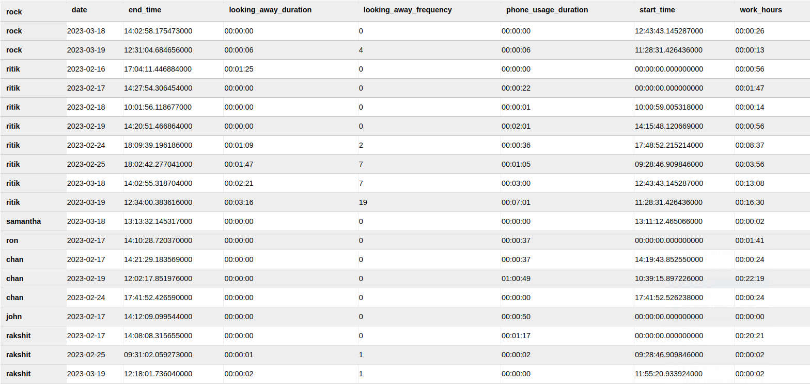
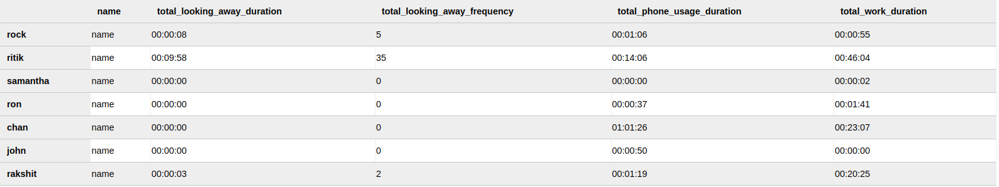

## 1. Introduction

### 1.1 Why this Low-Level Design Document?

The purpose of this Low-Level Design Document is to provide a detailed description of the "Company Work Environment Management" computer vision system. It will explain the purpose and features of the system, its technical requirements, data requirements, deployment strategy, performance metrics, and key performance indicators. This document is intended for both the stakeholders and the developers of the system and will serve as a guide for the implementation of the system.

The "Company Work Environment Management" system aims to improve employee attendance tracking and performance evaluation through the use of advanced face recognition technology and machine learning algorithms. By analyzing employee activity data, the system can provide insights into employee behavior and productivity, allowing for better work environment management.

This Low-Level Design Document is an essential component of the system development process, providing a comprehensive overview of the system's architecture and functionality. It will serve as a reference point for developers, allowing them to ensure that the system is implemented correctly.

### 1.2 Scope

The scope of this project is to develop a computer vision system named "Company Work Environment Management". The system will use advanced face recognition technology to improve employee attendance tracking and performance evaluation. The system will utilize a **Cassandra NoSQL database** to store and analyze employee activity data. The system will offer a modern and efficient solution to traditional attendance tracking and enhance the overall work environment management process. The system will use **Machine learning** for predictions and **Deep Learning** for detection. The system will be compatible with various platforms and will be deployable on different environments. The system will have user-friendly dashboards that will display **Key Performance Indicators (KPIs)** for easy monitoring and decision making. The primary objective of the system is to provide accurate attendance tracking, improve performance evaluation, maintain employee privacy and enhance the overall work environment management process.

## 2. Technical Details

### 2.1 Data Overview

### 2.2 **Daily Activity table:**

**Calculating Daily Activity**:

- The daily activity table stores the total duration of each pose for each employee, updated on a daily basis. To calculate the daily activity, we use the duration calculation function that is triggered every time a prediction is made. This function receives the predicted pose and the user ID as input, and checks if the pose has changed since the last prediction for the same user. If the pose is the same, the function updates the duration value for that pose and user ID combination by adding the time elapsed since the last prediction. If the pose is different, the function adds a new row to the daily activity table with the pose, user ID, and duration values for the previous pose, and starts tracking the duration for the new pose.

### 2.3 **Total Activity table:**

**Calculating Total Activity Table:**

- The system updates the "Total Activity" table every time a new prediction is made, along with updating the "Daily Activity" table. The "Total Activity" table keeps track of the total duration of all the activities performed by an employee over time, whereas the "Daily Activity" table keeps track of the activity performed by the employee for a particular day.

- Every time a new prediction is made, the system calculates the duration for the current activity and updates the "Daily Activity" table with the new duration. At the same time, the system also retrieves the total duration for the current activity from the "Total Activity" table for that particular employee and updates it by adding the new duration. Finally, the updated total duration is stored back in the "Total Activity" table for that employee.

- This approach ensures that the "Total Activity" table is constantly updated, and the information is always up-to-date.

## 3. Proposed Solution

### 3.1(A) Data collection Face
 
1. **Data collection using mediapipe (For Training, [initial stage]):**
- A computer vision system is set up to capture video footage of faces.
- Mediapipe library is used to extract facial landmarks. These landmarks are 3D points that represent specific facial features such as eyes, nose, mouth, etc.
- There are 468 facial landmarks in total, each with an x, y, and z coordinate as well as a visibility confidence score.
- These landmarks are saved as a set of numerical values (i.e. the x, y, z coordinates) along with their corresponding confidence scores in a CSV file.

2. **Labeling the data:**
    - In order to train a machine learning model, it's necessary to have labeled data.
    - For facial recognition, the labels would typically be the names or identities of the people in the video footage.
    - The labeled data is added to the CSV file in a separate column.

3. **Data cleaning and preprocessing:**
    - Before training the model, the data needs to be cleaned and preprocessed.
    - This involves removing any incomplete or inconsistent data points, normalizing the data, and splitting the data into training and testing sets.

4. **Model evaluation:**
    - Once the model is trained, it needs to be evaluated to see how well it performs on new data.
    - This involves testing the model on a separate set of data (i.e. the testing set) and measuring its accuracy and other performance metrics.
    - If the model performs well, it can be deployed for use in facial recognition applications.

### 3.1(B) Data Collection Face

1. **Data collection using Mtcnn or Dllib:**
    - A computer vision system is set up to capture video footage of faces.
    - Mtcnn (Multi-Task Cascaded Convolutional Neural Networks) or Dllib (Deep Learning Library for Face Detection) is used to detect faces within the footage.
    - The detected faces are then cropped from the rest of the background to create a standardized dataset of face images.

2. **Facial embeddings using facenet:**
    - Facenet is a deep learning model that creates numerical representations (embeddings) of facial features.
    - These embeddings can be used for tasks such as facial recognition, face clustering, and face verification.
    - For data collection, facenet is used to generate embeddings of the cropped face images.
    - These embeddings are saved as a set of numerical values in a CSV file.

3. **Labeling the data:**
    - In order to train a machine learning model, it's necessary to have labeled data.
    - For facial recognition, the labels would typically be the names or identities of the people in the video footage.
    - The labeled data is added to the CSV file in a separate column.

4. **Data cleaning and preprocessing:**
    - Before training the model, the data needs to be cleaned and preprocessed.
    - This involves removing any incomplete or inconsistent data points, normalizing the data, and splitting the data into training and testing sets.

### 3.2 Data Collection Pose:

The data collection process for capturing and labeling pose information involves the following steps:

1. **Open Video Frame:**
    - The process begins by opening a video frame using the OpenCV library. The video frame serves as the input source for pose detection and landmark extraction.

2. **Pose Landmark Detection:**
    - The Mediapipe library is employed to detect and locate pose landmarks in the video frame.
    - Pose landmarks refer to specific points on the body, such as wrists, elbows, shoulders, knees, and other key joints.
    - By utilizing advanced algorithms, Mediapipe accurately identifies these landmark points and provides their coordinates in the form of (x, y, z) along with a visibility score.
    - The visibility score indicates the confidence level of the detection, indicating whether the landmark is clearly visible or partially occluded.

3. **Landmark Data Compilation:**
    - The detected pose landmark data is then compiled and organized into a structured format, typically a CSV (comma-separated values) file.
    - Each row in the CSV file represents a specific frame or instance, while the columns correspond to different pose landmarks and their respective coordinates and visibility scores.
    - The compiled CSV file acts as a labeled dataset, with each row containing the pose landmark information necessary for training a specific pose.

The data collection process for pose involves utilizing the OpenCV library to open a video frame, leveraging the Mediapipe library for pose landmark detection, compiling the landmark data into a structured format (such as a CSV file), and finally using this labeled dataset to train a pose estimation model. This process forms the foundation for capturing and analyzing human poses.

### 3.3 Training the model:

1. **Artificial Neural Network (ANN):**
- ANNs are a type of machine learning algorithm that can learn highly complex relationships between inputs and outputs. They consist of multiple layers of interconnected neurons that process the input data and generate output predictions.
  - **Pros:** ANNs can achieve high accuracy and generalize well to new data, making them well-suited for classification problems like face recognition. They are also well-suited for data with high dimensions, such as the 468 3D facial landmarks obtained from Mediapipe.
  - **Cons:** ANNs can be computationally expensive and require more processing power, which means real-time prediction may not be feasible. One of the most notable disadvantages of ANNs is that they are prone to overfitting, which occurs when the model is trained on noise or irrelevant features in the data.

2. **K-nearest Neighbors (KNN):**
- KNN is a non-parametric, lazy learning algorithm that deals with comparing the current tuple of the dataset (in our case, a face) to each face in the registry and outputs the most similar face.
  - **Pros:** KNN can be an ideal solution for the problem of face recognition because it does not make any assumptions about the underlying distribution of the data and can handle both linear and non-linear relationships between the input features.
  - **Cons:** KNN is a non-trainable model and calculates the distances at the time of prediction, which can be computationally slow when more faces are present in the registry.

3. **Support Vector Machine (SVM):**
- SVMs are a popular machine learning algorithm that can work well for problems involving distance metrics. They are commonly used in classification tasks where the goal is to separate data points into different classes or categories, which makes them a good solution for our problem of classifying faces.
  - **Pros:** One of the advantages of SVMs is that they have a less tradeoff between accuracy and performance, meaning that they can achieve high accuracy without sacrificing performance. Another advantage of SVMs is that they are lightweight for prediction because they only have to calculate for k numbers (number of data points that can separate the classified group) of data points defined at the time of training. These data points are known as support vectors.
  - **Cons:** SVMs can handle high-dimensional data and can learn non-linear relationships between the input features.

4. **XG-BOOST:**
- XGBoost is a popular machine learning algorithm known for its high performance and effectiveness in various domains. It is an optimized implementation of the gradient boosting framework, which combines multiple weak learners to create a powerful ensemble model.
  - **Pros:** XGBoost can capture intricate patterns and complex relationships in the data. It has the capability to handle both linear and non-linear relationships, making it suitable for our use case. XGBoost offers various regularization techniques such as L1 and L2 regularization, which help prevent overfitting and improve generalization performance. Regularization techniques can also assist in handling noisy or irrelevant features in the data.
  - **Cons:** XGBoost can be computationally expensive, especially when dealing with large datasets and complex models. Training an XGBoost model with numerous features and deep trees may require substantial computational resources, but it can be optimized with proper parameters.

### 3.4 Training the Face Recognition Model:

In the face recognition pipeline, the first step is to train the model using face embeddings. Face embeddings are numerical representations of faces that capture the unique features and characteristics of each individual's face. During the data collection phase, we collected a dataset that contains both the face embeddings and their corresponding labels (identities).

- To train the face recognition model, we utilized a **Support Vector Classifier (SVC)** with a **linear kernel**.

    The training process involved the following steps:

    1. **Data Preparation:**
        - We organized the collected dataset, ensuring that each face embedding was associated with the correct label or identity.
        - The dataset was split into a training set and a validation set to evaluate the model's performance during training.

    2. **Model Training:**
        - We instantiated an SVC model with a linear kernel.

            **Reason for the linear kernel:**
            - **Computational Efficiency:** The linear kernel is computationally efficient compared to other kernel functions, such as polynomial or radial basis function (RBF) kernels. Since face recognition tasks often involve processing a large number of face embeddings and performing real-time predictions, using a linear kernel helps optimize the computational efficiency of the algorithm. This is particularly beneficial when deploying the face recognition system in resource-constrained environments or when dealing with a high volume of face recognition requests.
            - **Avoiding Overfitting:** The linear kernel tends to have a lower risk of overfitting compared to more complex kernels. Overfitting occurs when a model becomes too specialized to the training data and fails to generalize well to unseen data. By using a linear kernel, which has a simpler decision boundary, we can reduce the complexity of the model and mitigate the risk of overfitting. This helps ensure that the trained SVC model can accurately recognize faces not only from the training data but also from unseen faces in real-world scenarios.
            - **Interpretability and Transparency:** The linear kernel offers better interpretability and transparency compared to non-linear kernels. The decision boundary created by a linear kernel is a hyperplane that can be easily visualized and understood. This can be valuable for debugging and analyzing the model's behavior, as well as for explaining the face recognition system's predictions to stakeholders or end-users.
            - **Computational Efficiency in Cloud Computing Environments:** When deploying the face recognition model in a cloud computing environment with limited computational resources, efficiency becomes a crucial factor. Linear kernels are computationally less demanding compared to non-linear kernels, such as polynomial or RBF kernels. This computational efficiency allows the face recognition model to run smoothly and efficiently in cloud environments, even when multiple models or services are running concurrently. By using a linear kernel, we can optimize resource utilization and ensure that the face recognition system operates efficiently without compromising performance. This is particularly important in scenarios where real-time response and scalability are essential, such as large-scale face recognition applications or systems with high user traffic.

    3. **Model Evaluation:**
        - During the training process, we regularly evaluated the model's performance using the validation set.
        - Evaluation metrics such as accuracy, precision, recall, and F1 score were computed to assess the model's ability to correctly classify faces.

    4. **Model Persistence:**
        - Once the model training was completed, we saved the trained SVC model to disk for future use.
        - The saved model could be loaded and used for face recognition tasks in the prediction phase.

### 3.5 Training Pose Classification Model:

In the pose recognition stage of our pipeline, we aimed to train a model that could accurately classify different body poses based on input data. For this task, we
utilized the **XGBoost** algorithm, a popular gradient boosting framework known for
its efficiency and effectiveness in handling classification problems.

##### **To train the pose recognition model.**

The training process involved the following steps:

1. **Data Collection:**
    - We collected a dataset consisting of labeled images or videos that depict various body poses.
    - Each sample in the dataset contains the input image or video frame and the corresponding label indicating the pose.

2. **Data Preprocessing:**
    - Before training the pose recognition model, we performed data preprocessing to enhance the quality and suitability of the data.
    - The preprocessing steps included:

        **Removal of Unused Points:**
        - In the pose data, there might be certain key points or landmarks that are not relevant for the pose recognition task.
        - We can identify and remove these unused points from the dataset to reduce noise and focus on the essential features.

        **Dimensionality Reduction with PCA:**
        - Pose data often contains a high-dimensional feature space due to the large number of key points or landmarks.
        - To reduce the dimensionality of the data and remove redundant information, we can apply Principal Component Analysis (PCA).
        - PCA transforms the original features into a lower-dimensional representation while preserving the most significant variations in the data.
        - By reducing the dimensionality, we can aim to improve computational efficiency and mitigate the curse of dimensionality.

3. **Training Set and Validation Set Split:**
    - The dataset was divided into a training set and a validation set.
    - The training set was used to train the model, while the validation set was used to assess the model's performance during training and aid in hyperparameter tuning.

4. **Model Training:**

    **1. XGBoost Training:**
    - We trained an XGBoost classifier, which is a gradient boosting framework known for its high performance in classification tasks.
    - XGBoost combines multiple weak learners (decision trees) to create a strong predictive model.
    
        - In our case we can use n_estimators 100

    - The XGBoost model was trained on the preprocessed pose data, with the extracted features as input and the corresponding pose labels as the target variable.
    - The learning rate controls the step size during each boosting iteration.
        - We selected a moderate learning rate of 0.1 to balance model performance and training speed.
    - The maximum depth of a tree defines the level of interactions between features in the model. A higher max depth allows the model to capture more complex relationships in the data, but it also increases the risk of overfitting.
        - We chose a relatively shallow max depth of 5 to prevent overfitting and promote better generalization.
    - The colsample_bytree parameter determines the fraction of features to consider for each tree. A lower value reduces the risk of overfitting by introducing more randomness and diversity in the trees.
        - We chose a value of 0.8, meaning that each tree considers 80% of the features, to introduce some diversity while still maintaining a good coverage of the feature space.
    - The objective function defines the loss function to be optimized during training.
        - In this case, we used the 'multi:softmax' objective for multi-class classification.
        - It calculates the softmax probabilities for each class and selects the class with the highest probability as the predicted label.

    **2. Random Forest Training:**
    - In addition to XGBoost, we also trained a Random Forest classifier.
    - Random Forest is an ensemble learning method that constructs multiple decision trees and combines their predictions to make a final decision.
    - We adjusted the hyperparameters, including the number of trees and the maximum depth of trees, to achieve the best performance.
    - The Random Forest model was trained using the pose features and labels.

    **3. Ensemble Technique:**
    - To further enhance the model's performance, we employed an ensemble technique that combined multiple classifiers.
    - We experimented with various classifiers, including Logistic Regression, Ridge Classifier, Random Forest, and Gradient Boosting.
    - Each classifier was trained independently on the pose data using different algorithms and hyperparameter settings.
    - After training the individual classifiers, we evaluated their performance and selected the best-performing model for the ensemble.

    **4. Deep Learning with Sequential Model:**
    - **Input Layer:** The input layer receives the pose data as input, with the number of input dimensions determined by the shape of the input data.
    - **Dense Layers:** The model consists of multiple dense layers with different sizes and activation functions. Each dense layer is responsible for learning and capturing specific patterns and representations from the input data. We used the 'relu' activation function, which introduces non-linearity to the model and helps in capturing complex relationships within the data.
    - **Batch Normalization:** Batch normalization is applied after each dense layer. It normalizes the input values by subtracting the batch mean and dividing by the batch standard deviation. This technique helps in stabilizing the learning process and improving the overall performance of the model.
    - **Flatten Layer:** The flatten layer is added to convert the multi-dimensional output from the previous layers into a flat vector. It prepares the data for the subsequent dense layers by reshaping the data into a 1D format.
    - **Additional Dense Layer:** Following the flatten layer, we added another dense layer with 32 units and 'relu' activation. This additional dense layer allows the model to learn more complex representations and further refine the predictions.
    - **Dropout Layer:** A dropout layer with a dropout rate of 0.5 is included to prevent overfitting. Dropout randomly sets a fraction of input units to 0 during training, which helps in regularizing the model and reducing the chances of overfitting.
    - **Output Layer:** The final dense layer has the same number of units as the number of classes in the pose dataset. The activation function used in this layer is 'softmax', which normalizes the output probabilities across the classes.
    - **Model Compilation:** The model is compiled using the Adam optimizer with a learning rate of 0.01. The loss function is set to 'categorical_crossentropy' since it is suitable for multi-class classification tasks. We also specified 'accuracy' as the evaluation metric to monitor the model's performance during training.

    - The chosen architecture and parameter settings were based on experimentation and empirical observations. By using multiple dense layers with varying sizes, we aimed to capture different levels of abstractions in the pose data. The inclusion of batch normalization layers helped in improving the model's convergence and overall performance. The dropout layer mitigated overfitting by randomly dropping units during training. The 'softmax' activation function in the output layer ensured that the predicted probabilities were normalized across the different pose classes.

    - Overall, the sequential deep learning model was designed to effectively learn and extract relevant features from the input pose data, enabling accurate classification of different poses.

5. **Model Selection:**
    - After training multiple models using different techniques, we evaluated their performance on validation data.
    - Performance metrics such as accuracy, precision, recall, and F1 score were computed to assess the models' effectiveness in pose recognition.
    - Based on the evaluation results, we selected the best-performing model, which in this case was the XGBoost classifier.
    - The XGBoost model demonstrated superior performance in terms of accuracy, speed and generalization ability, making it the optimal choice for pose recognition in our project.

## 4. Hosting:

Before we can move on to the prediction stage, we first need to host the web application that runs the pipeline of **Face > Pose > Preprocessing > Prediction > Database Management > Cloud Services > Implementation**

To achieve this, we will create a Flask web application using Python and JavaScript. Flask is a popular web framework for Python that allows us to create web applications easily and quickly. We will use JavaScript to capture the webcam stream from the user's device.

### **4.1 Things to keep in mind when hosting:**

1. When hosting our face recognition application, there are technical considerations to keep in mind, especially regarding the capturing of live video from the user's webcam. Here's how we can address this challenge:

    **Using JavaScript for Webcam Capture:** When hosting our application on a cloud platform, we cannot directly access the user's webcam using OpenCV's video capture methods. To overcome this limitation, we can leverage JavaScript to enable webcam access through the browser. This can be achieved using the **getUserMedia()** function, which allows us to capture video and audio from the user's device.

    **Encoding and Sending Packets:** Once we have captured the video stream using JavaScript, we need to encode and send the video packets from the client-side (frontend) to the server-side (backend) where our Flask application resides. This can be done by encoding the video frames into a suitable format, such as base64 or binary, and sending them as packets to the backend using **AJAX or WebSocket** communication.

    **Processing and Decoding Packets:** On the backend side, we receive the encoded video packets sent by the client. We then decode the packets to retrieve the video frames. Once the frames are decoded, we can perform the necessary processing steps, such as face detection, pose estimation, and preprocessing, using the appropriate algorithms and libraries.

    **Sending Results back to the Client:** After processing the video frames, we generate the desired results, such as recognized faces or identified activities. We then send the results back to the client-side (frontend) using a similar mechanism as before, encoding the results into packets and transmitting them through **AJAX or WebSocket** communication.

2. **Webcam Capture and SSL Certificate:** To capture webcam frames and landmarks using the **getUserMedia()** function in JavaScript, it is essential to have a secure connection with an SSL certificate. Without an SSL certificate, modern web browsers may block access to the camera, as the API requires a secure context.

    **To enable a secure connection, we need to obtain an SSL certificate. In the case of hosting our application on AWS EC2, the IP address provided by AWS does not include an SSL certificate. Therefore, we can acquire the SSL certificate from a different certificate provider. In this documentation, we will use Let's Encrypt, a widely-used certificate authority, to generate our SSL certificate.**

    **Obtaining an SSL Certificate from Let's Encrypt:** To obtain an SSL certificate from Let's Encrypt, we need to follow a set of steps. These steps generally involve the following:
    - Setting up a web server, such as Nginx or Apache, to serve our application.
    - Installing Certbot, a tool provided by Let's Encrypt, on our server.
    - Running Certbot to generate and obtain the SSL certificate for our domain.
    - Configuring the web server to use the SSL certificate and enable HTTPS.

    By following this process, we can secure our frontend page with an SSL certificate, allowing us to access the webcam frames and landmarks using the **getUserMedia()** function.

    **Configuring Web Server and HTTPS:** After obtaining the SSL certificate, we need to configure our web server to use HTTPS. This involves modifying the server configuration file, such as Nginx or Apache, to enable HTTPS connections. The configuration typically includes specifying the SSL certificate file path and configuring the server to listen on the appropriate HTTPS port (usually port 443).

    **Securing Communication and Data Privacy:** With the SSL certificate in place and HTTPS enabled, our frontend page is now secure, ensuring the privacy and integrity of the data transmitted between the client (browser) and server. This is crucial when capturing webcam frames and transmitting them to the backend for further processing.

By following these steps and securing our frontend page with an SSL certificate, we can ensure that the **getUserMedia()** function works properly, allowing us to initialize and capture frames from the user's webcam. This enhances the functionality and security of our face recognition application.

To deploy our Flask application, we can choose from various hosting platforms like **Amazon Web Services (AWS)**, **Microsoft Azure**, **Heroku**, or **Replit**.

### **4.2 Hosting Platforms:**

To deploy your Flask application and enable webcam access for users, we will utilize **Amazon Web Services (AWS)** and set up an **Ubuntu virtual machine (VM)** as the hosting environment.

1. **Launch an Ubuntu VM on AWS:**
    - Sign in to the AWS Management Console and navigate to the EC2 service.
    - Launch a new Ubuntu EC2 instance, selecting the desired instance type, storage, and networking options.
    - Configure security group rules to allow incoming traffic on port 80 (HTTP) and 443 (HTTPS) for web access.
    - Assign an Elastic IP to the VM for a static public IP address.

2. **Set Up Ubuntu VM:**
    - Connect to the Ubuntu VM via SSH using a tool like PuTTY or the terminal.
    - Update the system packages using the **apt-get** package manager.
    - Install Python and the necessary dependencies, including Flask and any additional libraries required for your application.
    - Clone your Flask application repository onto the VM.

3. **Configure Nginx as Reverse Proxy:**
    - Install Nginx web server on the Ubuntu VM using **apt-get**.
    - Configure Nginx to act as a reverse proxy for your Flask application.
    - Set up server blocks in the Nginx configuration file to define the domain or subdomain for your application and forward requests to the Flask application running on port 5000.

4. **Obtain SSL Certificate:**
    - Use Let's Encrypt, a free certificate authority, to obtain an SSL certificate for your domain or subdomain.
    - Install Certbot and run the necessary commands to generate and install the SSL certificate on the Nginx server.
    - Configure Nginx to use the SSL certificate for secure HTTPS communication.

5. **Configure DNS:**
    - In DNS provider's control panel, create an A record that points domain or subdomain to the Elastic IP address of AWS VM.
    - Set up the required DNS settings to ensure the domain or subdomain resolves to the correct IP address.

6. **Start the Flask Application:**
    - Activate a virtual environment and install the project dependencies using pip.
    - Run the Flask application using Gunicorn or a similar WSGI server.
    - Monitor the application logs and ensure it is running without any issues.

By following these steps, we can successfully deploy our Flask application on an AWS Ubuntu VM, configure Nginx as a reverse proxy, obtain an SSL certificate for secure communication, and ensure proper DNS configuration for our domain or subdomain. This setup enables users to access our application securely over HTTPS, granting webcam access and enabling the processing of live video streams.

## 5. Prediction:

### 5.1 **Data Collection:**
- The data is collected from the web using a JavaScript function, specifically the **getUserMedia()** function. This allows access to the user's camera stream and captures frames for further processing. This approach is necessary because direct camera access using OpenCV functions is restricted in a cloud environment.

### 5.2 **Pose Landmark Calculation:**
- The captured frames are processed using the MediaPipe JavaScript library to calculate the pose landmarks. This involves identifying and tracking key points on the user's body, such as joints and body parts. The pose landmarks provide valuable information about the user's body posture and movements.

### 5.3 **Packet Encoding and Transmission:**
- Once the pose landmarks are calculated, the data is encoded into packets and sent to the backend (Python) using **AJAX and WebSockets**. This communication mechanism ensures efficient and real-time transmission of the data from the frontend (JavaScript) to the backend (Python).

### 5.4 **Backend Processing:**
- The data received by the backend (Python) through Flask is then fed into the prediction pipeline. In this pipeline, several steps are performed to extract relevant information and make predictions.

    **Face Recognition:** The face embeddings are extracted from the captured frames. These embeddings represent unique features of the user's face. The embeddings are compared with past records or a pre-trained model to identify and recognize the user's face. This enables the system to associate the current user with their identity.

    **Pose Prediction:** The pose landmarks obtained from the frontend are utilized to predict the user's body posture and movements. This prediction can include classifying the user's pose into predefined categories such as sitting, standing, or walking. It provides valuable insights into the user's actions and behaviors.

### 5.5 **Database Handling:**
- The results of the predictions, including the recognized face and the predicted pose, are sent to a database handler library. This library is responsible for storing the records in a database. The recorded data can be used for further analysis, tracking user activity, or generating reports. Additionally, the results can be displayed on the user application, allowing real-time feedback and interaction with the system.

### 5.6 **Results:**
- The results are then sent to Application (frontend) and shown to the user with **Ajax**.
- Using Ajax here because of uninterrupted updating DOM.
