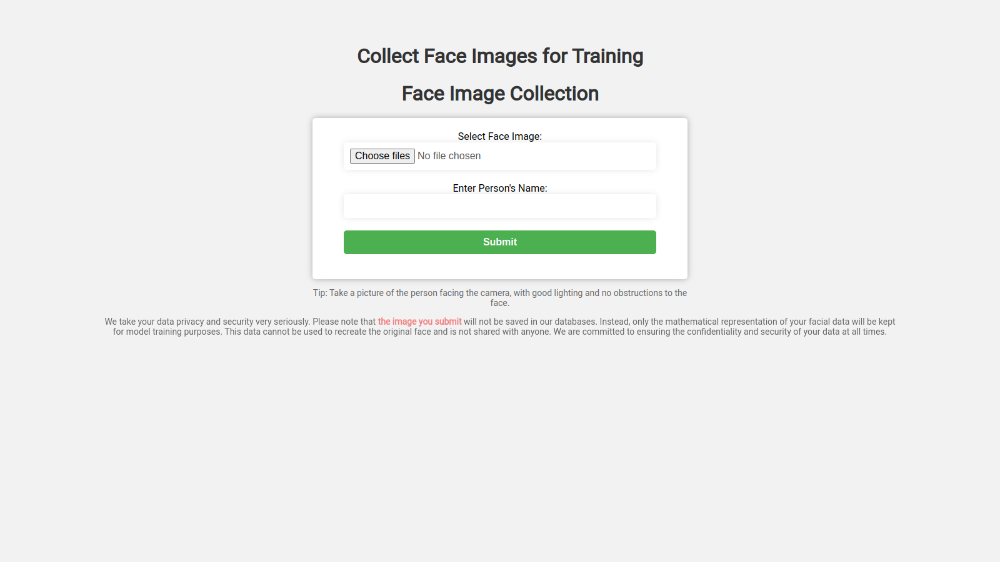
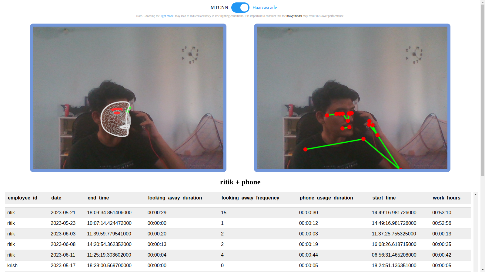

# Wireframe Documentation

## 1. Homepage

The user interface (UI) of the application is designed with simplicity in mind, prioritizing ease of use for the users. It consists of the following elements:

### 1.1 **Homepage:** 

The homepage prominently displays the company name, providing a clear identification of the application's association with the organization.

### **1.2 User Choices:**
The UI offers two main choices for the users to select from. These options include "Get Started" and "Train Face," allowing users to navigate to different functionalities based on their specific needs.

### **1.3 Developer Information:** 
The UI also includes information about the developer, including their name, GitHub profile, and links to their social media profiles. This provides transparency and enables users to connect with the developer for support, feedback, or further engagement.

## 2. Face Training Window

### **2.1 Face Training Window:** 
Upon selecting the "Train Face" option, the user is presented with an additional wind
ow. This window prompts the user to provide a face image and specify the corresponding user name for training the model with a new face. This step allows for the expansion and customization of the face recognition capabilities.

### **2.2 Model Training Process:** 
Once the user submits the face image and user name by clicking the submit button, the application initiates the model training process. This process involves leveraging machine learning techniques to train the model using the provided face image as a reference for the specified user. Through this training phase, the model learns to recognize and differentiate the newly introduced face, enhancing its ability to accurately identify individuals.

## 3. Main Application Work
When users navigate to the home page and select the "Getting Started" option, they initiate the execution of our application, which comprises the following technical components:

### **3.1 Toggle Box:** 
The home page features a toggle box that enables users to choose between a light model and a heavy model. By default, the light model is pre-selected. This toggle box provides flexibility in selecting the appropriate model based on the specific requirements of the user.

### **3.2 Face Detection and Pose Landmarks:** 
Below the toggle switch, two containers are displayed. The first container showcases real-time face detection functionality, utilizing advanced computer vision techniques to identify and locate faces within the camera feed. The second container displays pose landmarks points, which correspond to specific key points on the human body, such as the eyes, nose, and hands. This provides users with a detailed understanding of the pose and positioning of individuals captured by the camera.

### **3.3 Result Label:** 
Positioned below the face detection and pose landmarks containers, the result label provides immediate feedback to the user. It displays relevant information such as the identified username and the detected pose, allowing users to quickly assess the outcome of the analysis performed by the application.

### **3.4 Database:** 
Positioned below the result label, the database container is dynamically updated as new pose data is captured and registered. This database keeps track of user poses and their corresponding durations, continuously updating the records to reflect real-time changes. This feature enables comprehensive tracking and monitoring of users' pose behaviors over time.

